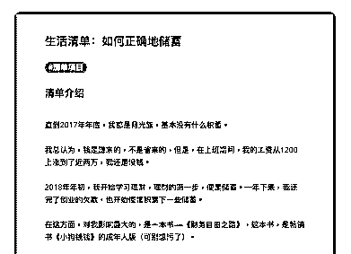
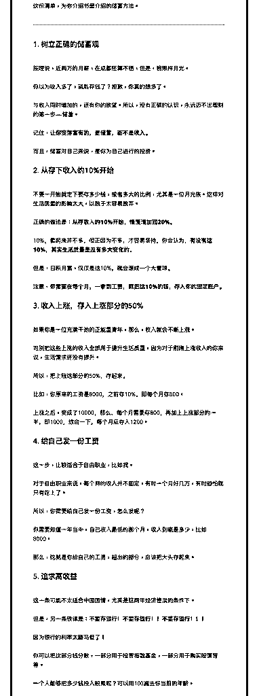
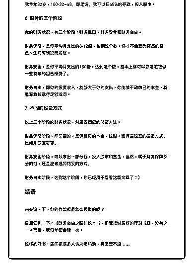

# 34.

《

《20190122 如何正确地储蓄》

【清单介绍】 直到 2017 年年底，我都是月光族，基本没有什么积蓄。

我总认为，钱是赚来的，不是省来的，但是，在上班期间，我的工资从 1200 上 涨到了近两万，我还是没钱。

2018 年年初，我开始学习理财，理财的第一步，便是储蓄。一年下来，我还完 了创业的欠款，也开始慢慢积累下一些储蓄。

在这方面，对我影响最大的，是一本书——《财务自由之路》，这本书，是畅 销书《小狗钱钱》的成年人版（可别想污了）。

这份清单，为你介绍书里介绍的储蓄方法。

---

【 1\. 树立正确的储蓄观】 按理说，近两万的月薪，在成都还算不错，但是，我照样月光。 你以为收入多了，就能存钱了？抱歉，你真的想多了。

与收入同时增加的，还有你的欲望。所以，没有正确的认识，永远迈不出理财 的第一步——储蓄。

记住，**让你变得富有的，是储蓄，而不是收入。**

而且，储蓄对自己来说，是你为自己进行的投资。

【2\. 从存下收入的 10%开始】 不要一开始就定下要存多少钱，或者多大的比例，尤其是一位月光族。这样对

生活质量的影响太大，以致于太容易放弃。

正确的做法是：**从存收入的 10%开始，慢慢增加到 20%。** 10%，看起来并不多，但正因为不多，才容易坚持，你会认为，**有没有这

10%，其实生活质量是没有多大变化的。**

但是，日积月累，仅仅是这 10%，就会滚成一个大雪球。 注意，**你需要在每个月，一拿到工资，就把这 10%的钱，存入你的固定账

户。**

【3\. 收入上涨，存入上涨部分的 50%】 如果你是一位充满干劲的正能量青年，那么，收入就会不断上涨。

可别把这些上涨的收入全部用于提升生活质量，因为对于刚刚上涨收入的你来 说，生活需求还没有提升。

所以，把上涨这部分的 50%，存起来。 比如，你原来的工资是 8000，之前存 10%，即每个月存 800。 上涨之后，变成了 10000，那么，每个月需要存 800，再加上上涨部分的一半，

即 1000，综合一下，每个月应存入 1200。

【4\. 给自己发一份工资】 这一步，比较适合于自由职业，比如我。

对于自由职业来说，每个月的收入并不固定，有时一个月好几万，有时恐怕就 只有吃土了。

所以，你需要给自己发一份工资，怎么发呢？ 你需要知道一年当中，自己收入最低的那个月，收入到底是多少，比如 8000。 那么，这就是你给自己的工资，超出的部分，应该把大头存起来。

【5\. 追求高收益】 这一条可能不太适合中国国情，尤其是这两年经济惨淡的条件下。 但是，另一条铁律是：**不要存银行！不要存银行！！不要存银行！！！**

因为银行的利率太踏马低了！

你可以把这部分钱分散，一部分用于投资指数基金，一部分用于购买股票等 等。

一个人能够把多少钱投入股票呢？可以用 100 减去你当前的年龄。

我今年 32 岁，100-32=68，即是说，我可以把 68%的存款，投入股市。

【6\. 财务的三个阶段】 你的财务状况，有三个阶段：财务保障、财务安全和财务自由。

财务保障，是你平均月支出的 6-12 倍，达到这个数，你才不会因为突然的裁 员、生病等情况而发愁。

财务安全，是你平均月支出的 150 倍，达到这个数，基本上你可以靠这笔钱做 一些复杂的组合投资了。

财务自由，即你的投资收入，能够大于你的支出，你能够不动自己的本金，就 能靠收益活得足够滋润。

【7\. 不同的投资方式】 以上三个阶段的财务状况，对应着相应的储蓄方法。

财务保障阶段，你需要的，是保证你的本金，这时，选择最稳妥的投资方式， 比如余额宝等等。

财务安全阶段，可以拿出一部分钱，投入股市和基金，当然，属于财务保障部 分的钱，还是应该选择稳妥的方式。

财务自由阶段，达到这个阶段，你已经用不着看这篇文章了：）

【结语】 来交流一下，你的存款都是怎么投资的呢？

最后安利一下：《财务自由之路》这本书，是我读过最好的理财书籍，没有之 一。而且，我每年都会读一次。

这样的好书，居然被很多人认为是鸡汤，真是想不通…… 评论：

