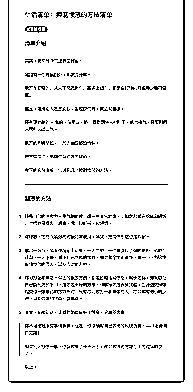

# 35.

《

《20190121 控制愤怒的方法清单》

【清单介绍】 其实，我平时脾气还算蛮好的。 唯独有一个时候例外，那就是开车。

我开车挺稳的，从来不恶意别车，高速上超车，都是在打转向灯数秒之后再变 道。

但是，如果别人恶意别我，我这脾气呀，就立马暴棚。 还有更奇葩的——我的一位朋友，路上看到陌生人被别了，他也来气，还要别

回来帮别人出口气。

他开的是特斯拉，一般人加速都没他快。 但不管怎样，暴脾气总归是不好的。

今天的这份清单，告诉你几个控制愤怒的方法。

---

【制怒的方法】

1\. 转移自己的注意力。生气的时候，想一些其它的事，比如之前我在给嘟嘟喂 饭时也很容易发火，后来，我一边听书一边喂饭。

2\. 深呼吸。在克服紧张的时候经常使用，其实，控制愤怒这也是妙招。

3\. 拿出一张纸，或者在 App 上记录，一天当中，一件事引起了你的愤怒，就做 个计划，一天下来，看下自己愤怒的次数，如果某个类别很多，想一下，为这 类事情愤怒的原因，以及应对的方案。

4\. 练习打坐和冥想。以上的很多方法，都是暂时缓解愤怒，属于治标，如果想 让自己脾气更加平和，这才是最好的方法。科学家做过很多实验，当身边突然 想起类似于爆米花的爆炸声时，只有练习过打坐和冥想的人，才会拥有最小的 反映，以及最快的状态回复速度。

5\. 其实，有两句话，让我的路怒症好了很多，分享给大家——

> 你不可能对所有事情负责，但是，你必须对自己做出的反映负责。——《财 务自由之路》

>

> 如果别人打你一拳，你躲过去了还不还手，就会显得对方像个用力过猛的傻

子。

以上。 评论：

