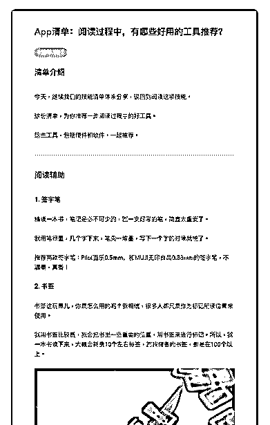
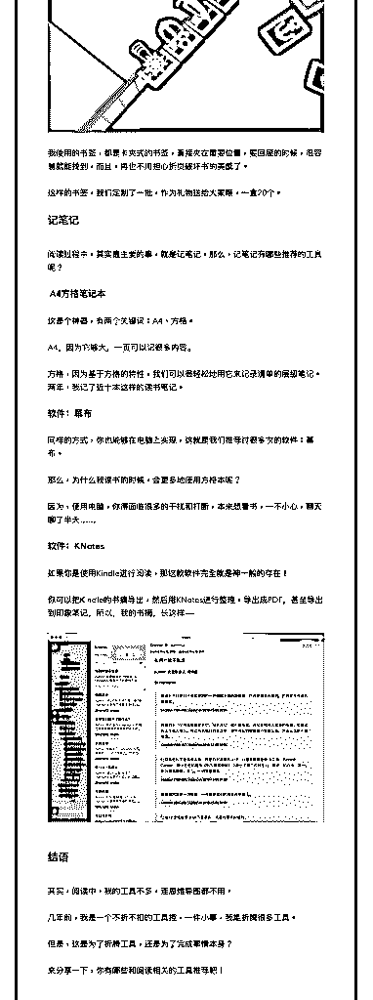

# 36.

《20190117 阅读过程中，有哪些好用的工具推荐？》

【清单介绍】 今天，继续我们的技能清单体系分享，说回到阅读这项技能。 这份清单，为你推荐一些阅读过程中的好工具。

这些工具，包括硬件和软件，一起推荐。

---

【阅读辅助】

〖1\. 签字笔〗 精读一本书，笔记是必不可少的，而一支好写的笔，简直太重要了。 我用笔很重，几个字下来，笔尖一堆墨，写下一个字的时候就惨了。 推荐两款签字笔：Pilot 百乐 0.5mm，和 MUJI 无印良品 0.38mm 的签字笔，不漏

墨，真香！

〖2\. 书签〗 书签这玩意儿，你是怎么用的呢？我相信，很多人都只是作为标记所读位置来

使用。

我用书签比较费，我会把书里一些重要的位置，用书签来进行标记。所以，我 一本书读下来，大概会耗费 10 个左右标签，而我储备的书签，都是在 100 个以 上。

[图片]

我使用的书签，都是卡夹式的书签，直接夹在重要位置，要回顾的时候，很容 易就能找到，而且，再也不用担心折页破坏书的美感了。

这样的书签，我们定制了一批，作为礼物送给大家哦，一盒 20 个。

【记笔记】

阅读过程中，其实最主要的事，就是记笔记，那么，记笔记有哪些推荐的工具 呢？

〖A4 方格笔记本〗 这是个神器，有两个关键词：A4、方格。 A4，因为它够大，一页可以记很多内容。

方格，因为基于方格的特性，我们可以很轻松地用它来记录清单的层级笔记。 两年，我记了近十本这样的读书笔记。

〖软件：幕布〗 同样的方式，你也能够在电脑上实现，这就是我们推荐过很多次的软件：幕

布。

那么，为什么我读书的时候，会更多地使用方格本呢？ 因为，使用电脑，你得面临很多的干扰和打断，本来想看书，一不小心，聊天

聊了半天……

〖软件：KNotes〗

如果你是使用 Kindle 进行阅读，那这款软件完全就是神一般的存在！ 你可以把 Kindle 的书摘导出，然后用 KNotes 进行整理，导出成 PDF，甚至导出

到印象笔记，所以，我的书摘，长这样——

[图片]

【结语】 其实，阅读中，我的工具不多，连思维导图都不用。

几年前，我是一个不折不扣的工具控，一件小事，我能折腾很多工具。 但是，这是为了折腾工具，还是为了完成事情本身？ 来分享一下，你有哪些和阅读相关的工具推荐吧！

评论：

