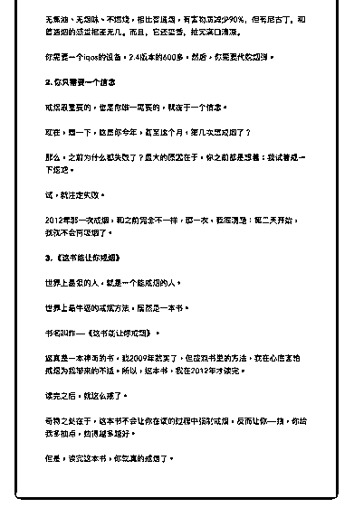

# 37.

《

《20190115 想戒烟？看看这份清单吧～》

【清单介绍】

2007 年，大二，开始抽烟，抽了五年。

2012 年，戒烟。 四年之后，2016 年，应酬之下，又开始抽烟。

几乎每个抽烟的人，都想戒烟，所以，从骨子里来说，没人认为烟是个好东西

——既然想戒烟，为什么又要抽烟呢？

这个问题，似乎是困扰烟民的一大玄学问题。 这份清单，告诉你戒烟的正确方法。如果你不抽烟，可以分享给你关心的人。

PS：最近我也打算再次戒烟，只不过，我沉迷一个新玩意儿不能自拔（下文 有分享）。

---

【戒烟的错误方法清单】

**1\. 别去看网上那些吸烟多么有害** 有多大的害处我们每个人都知道，所以，这如果能让你戒烟的话，你早就戒

了，不是吗？

而事实是，在很多国家，肿瘤医院门口的烟头最多，呵呵。 因为，吸烟者认为，有压力了，我得来支烟压压惊。 但问题是，压力的反面——放松的时候，我特么还是得来支烟。 什么鬼逻辑！

**2\. 别去计算吸烟需要多少钱** 吸烟真挺费钱的，一年至少能换个 iPhone 了。 很多人戒烟的做法是：把买烟的钱存在那里，以此激励自己。

这种做法也是相当有害的，因为，这会让你潜意识里认为，戒烟是一种牺牲。 既然是牺牲，你还有多大的信心把它执行下去？

**3\. 减量戒烟法是最大谎言**

每个想戒烟的人都听过这样的方法：你一天抽一包，就慢慢减少，第二天抽 15 支，第三天抽 10 支，慢慢就戒了。

作为一个过来人，我只想说：我信你个鬼，这个糟老头坏得很！ 使用这种方法的戒烟过程，其实是最痛苦的，因为，减量之前，你可能抽得更

少，而减量之后，你会去计算抽的每一根烟，而且对下一根烟充满期待。

也许你和我一样，即使是抽烟的过程中，也会觉得烟味让你反胃，但使用减量 的方法戒烟，会让你慢慢认为，抽烟真是一种享受。

**4\. 烟真的没什么用** 吸烟者通常认为，抽烟能让自己打起精神。 这又是一个常见的谎言。 但某种意义上，这也是事实。

一个老烟枪，抽了一支烟，感觉会好很多，这绝对不是幻觉，也的确是烟的功 劳。

但是，更深层次的事实是，烟先把你的精神状态拉低到一个相当低的水平，然 后，再通过抽一根烟的方式，来回复一点点。

你的正常状态是 100 分，烟会把你的正常状态拉低到 60 分，不抽烟，状态降到

55 分，抽一支烟，又回到 60 分。

然后，吸烟者就开始鼓吹：我靠，烟真特么是个好东西。

**5\. 戒烟其实并不难** 虽然我复吸了，但我一直认为，戒烟完全不难，2012 年我戒烟，今天说戒，第

二天就完全不抽了。

有人认为，烟瘾很难戒除。但其实，烟草中唯一的成瘾物质——尼古丁，并不 能引起任何的戒断反应，它不像海洛因等毒品那样，会改变人的神经回路。

尼古丁完全没有戒断反映，否则，你怎么可能不在睡梦中被弄醒？ 烟瘾，完全是心理上的作用，或者，是你的习惯，在提醒你该来根烟了。嗯，

我便是后者，因为，我一直很讨厌烟味。

【正确的戒烟方法】

**1\. 使用 iqos** 这就是我现在沉迷的玩意儿，在日本的公共场合也能抽的 iqos。 无焦油、无烟味、不燃烧，相比普通烟，有害物质减少 90%，但有尼古丁，和

普通烟的感觉相差无几。而且，它还挺香，抽完满口清凉。

你需要一个 iqos 的设备，2.4 版本的 600 多，然后，你需要代购烟弹。

**2\. 你只需要一个信念**

戒烟最重要的，也是你唯一需要的，就在于一个信念。 现在，想一下，这是你今年，甚至这个月，第几次想戒烟了？

那么，之前为什么都失败了？最大的原因在于，你之前都是想着：我试着戒一 下烟吧。

试，就注定失败。

2012 年那一次戒烟，和之前完全不一样，那一次，我很清楚：第二天开始，我 就不会再吸烟了。

**3\. 《这书能让你戒烟》** 世界上最狠的人，就是一个能戒烟的人。 世界上最牛逼的戒烟方法，居然是一本书。 书名叫作——《这书能让你戒烟》。

这真是一本神奇的书，我 2009 年就买了，但按照书里的方法，我在心底害怕戒 烟为我带来的不适。所以，这本书，我在 2012 年才读完。

读完之后，就这么戒了。 奇特之处在于，这本书不会让你在读的过程中强制戒烟，反而让你——抽，你

给我多抽点，抽得越多越好。

但是，读完这本书，你就真的戒烟了。 评论：

