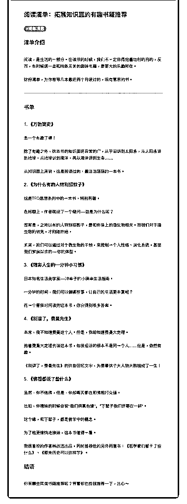

# 38.

《

《20190111 拓展知识面的有趣书籍推荐》

【清单介绍】

阅读，是生活的一部分。在读书的时候，我们不一定非得抱着功利的目的，反 而，有时候读一些和技能无关的趣味书籍，是更大的乐趣所在。

这份清单，为你推荐几本最近两个月读过的，很有意思的书。

---

【书单】

〖1\. 《万物简史》〗 怎一个有趣了得！

除了有趣之外，这本书的知识面还异常的广，从宇宙讲到太阳系，从太阳系讲

到地球，从地球讲到海洋，再从海洋讲到生命……

从知识面上来说，这是我读过的，最浩浩荡荡的一本书。

〖2\. 《为什么有的人特别招蚊子》〗 这是 TED 思想系列中的一本书，特别有趣。 在标题上，作者就设下一个疑问——这是为什么呢？ 答案是，之所以有的人特别招影子，是和你身上的微生物相关。而我们对于微

生物的研究，才刚刚开始。

未来，我们可以通过对于微生物的干预，来控制一个人性格、消化系统，甚至 我们梦寐以求的——你的体型。

〖3\. 《精彩人生的一分钟小习惯》〗 日本知名生活美学家——冲幸子的小确幸生活指南。 一分钟的时间，我们可以做哪些事，让自己的生活更丰富呢？ 花一个番茄时间读完这本书，你会得到很多答案。

〖4\. 《别逗了，费曼先生》〗 本来，我不知道费曼这个人。但是，我却知道费曼大定理。 抱着费曼大定理去读这本书，却发现讲的根本不是同一个人……但是，依然有

趣。

《别逗了，费曼先生》的这些回忆文字，为费曼这个大人物大致描绘了一生！

〖5\. 《佛祖都说了些什么》〗 虽然，你不信佛，但是，你却每天都在和佛祖打交道。 比如，你撩妹的时候会说“我们俩真有缘”，“下辈子我们还要在一起”。 这个缘，和下辈子，都是佛学中的概念。 为了能更愉快地撩妹，这本书值得一看。 我很喜欢的作者林欣浩出品，同时推荐他的另外两套书：《哲学家们都干了些

什么》、《原来历史可以这样学》。

【结语】 你有哪些同类书籍推荐呢？等着你也给我推荐一下，比心～

评论：

