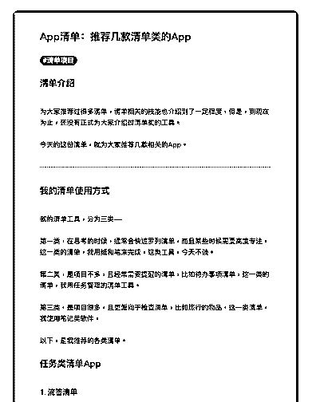
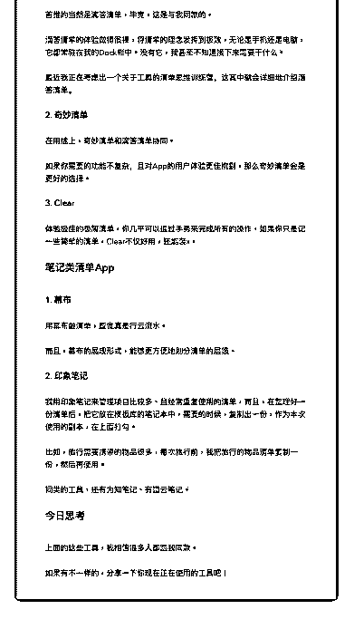

# 39.

《

《20190109 推荐几款清单类的 App》

【清单介绍】

为大家推荐过很多清单，清单相关的技能也介绍到了一定程度，但是，到现在 为止，还没有正式为大家介绍过清单类的工具。

今天的这份清单，就为大家推荐几款相关的 App。

---

【我的清单使用方式】 我的清单工具，分为三类——

第一类，在思考的时候，通常会快速罗列清单，而且某些时候需要高度专注， 这一类的清单，我用纸和笔来完成，这类工具，今天不谈。

第二类，是项目不多，且经常需要提醒的清单，比如待办事项清单，这一类的 清单，我用任务管理的清单工具。

第三类，是项目很多，且更偏向于检查清单，比如旅行的物品，这一类清单， 我使用笔记类软件。

以下，是我推荐的各类清单。

【任务类清单 App】

〖1\. 滴答清单〗 首推的当然是滴答清单，毕竟，这是与我同款的。

滴答清单的体验做得很棒，将清单的理念发挥到极致，无论是手机还是电脑， 它都常驻在我的 Dock 栏中。没有它，我甚至不知道接下来需要干什么。

最近我正在考虑出一个关于工具的清单思维训练营，这其中就会详细地介绍滴 答清单。

〖2\. 奇妙清单〗 在用途上，奇妙清单和滴答清单协同。

如果你需要的功能不复杂，且对 App 的用户体验更佳挑剔，那么奇妙清单会是 更好的选择。

〖3\. Clear〗 体验极佳的极简清单，你几乎可以通过手势来完成所有的操作，如果你只是记

一些简单的清单，Clear 不仅好用，还能装 x。

【笔记类清单 App】

〖1\. 幕布〗 用幕布做清单，感觉真是行云流水。

而且，幕布的展现形式，能够更方便地划分清单的层级。

〖2\. 印象笔记〗 我用印象笔记来管理项目比较多、且经常重复使用的清单，而且，在整理好一

份清单后，把它放在模板库的笔记本中，需要的时候，复制出一份，作为本次

使用的副本，在上面打勾。

比如，旅行需要携带的物品很多，每次旅行前，我把旅行的物品清单复制一 份，然后再使用。

同类的工具，还有为知笔记、有道云笔记。

【今日思考】 上面的这些工具，我相信很多人都跟我同款。 如果有不一样的，分享一下你现在正在使用的工具吧！

评论：

