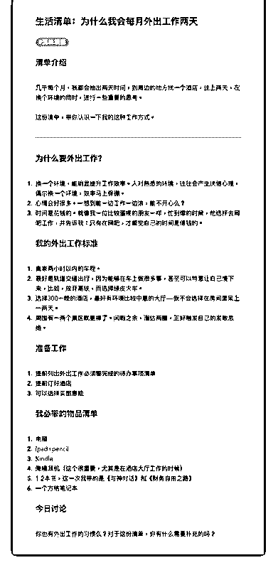
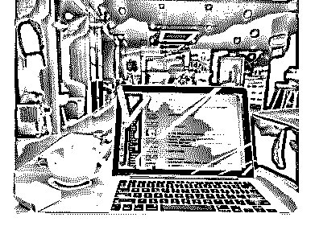

# 40.

《

《20190108 为什么我会每月外出工作两天》

【清单介绍】

几乎每个月，我都会抽出两天时间，到周边的地方找一个酒店，住上两天，在 换个环境的同时，进行一些重要的思考。

这份清单，带你认识一下我的这种工作方式。

---

【为什么要外出工作？】

1\. 换一个环境，能明显提升工作效率。人对熟悉的环境，往往会产生厌倦心 理，偶尔换一个环境，效率马上保棚。

2\. 心情会好很多。一想到能一边工作一边浪，能不开心么？

3\. 时间是花钱的。就像我一位比较蛋疼的朋友一样，忙到爆的时候，他选择去

网吧工作，并告诉我：只有在网吧，才感觉自己的时间是值钱的。

【我的外出工作标准】

1\. 离家两小时以内的车程。

2\. 最好是轨道交通出行，因为能够在车上做很多事，甚至可以特意让自己慢下

来，比如，放弃高铁，而选择绿皮火车。

3\. 选择 300 一晚的酒店，最好有环境比较中意的大厅——我不会选择在房间里 呆上一两天。

4\. 周围有一两个景区就更棒了。闲暇之余，溜达两圈，正好触发自己的发散思 维。

【准备工作】

1\. 提前列出外出工作必须要完成的待办事项清单

2\. 提前订好酒店

3\. 可以选择买旅意险

【我必带的物品清单】

1.  电脑

2.  ipad+pencil

3.  Kindle

4\. 降噪耳机（这个很重要，尤其是在酒店大厅工作的时候）

5\. 1-2 本书，这一次我带的是《与神对话》和《财务自由之路》

6\. 一个方格笔记本

【今日讨论】 你也有外出工作的习惯么？对于这份清单，你有什么需要补充的吗？

评论：

