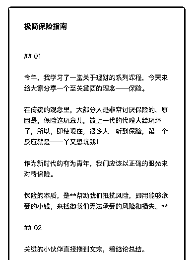

# 41.

《

《20190103 极简保险指南》

【01】 今年，我学习了一堂关于理财的系列课程，今天来给大家分享一个至关重要的

理念——保险。

在传统的观念里，大部分人是非常讨厌保险的，原因是，保险这玩意儿，被上 一代的代理人给玩坏了，所以，即使现在，很多人一听到保险，第一个反应就 是——丫又想坑我！

作为新时代的有为青年，我们应该以正确的眼光来对待保险。 保险的本质，是**帮助我们抵抗风险，即用能够承受的小钱，来抵御我们无法

承受的风险和损失。**

【02】 关键的小伙伴直接拖到文末，看结论总结。

配置保险，有两个关键的维度：1\. 买什么保险；2\. 为谁买保险。 先说第一个问题——买什么保险。

保险的责任是帮助我们抵御无法承受的风险和损失，所以，如果说什么保险是 必须要购买的，那就三个类别：意外险、重疾险和寿险。

意外险，很好理解，谁也不能保证人走在路上不会被天上掉下来的东西砸中， 如果这个东西不是馅饼，而是砖头，那就是意外了。

你永远不知道，明天和意外，哪个会先来。 所以，谁都应该买一份意外险。

重疾险，是指像癌症这样可怕的疾病，谁得了都承受不起，更可怕的是，现在 恶性肿瘤的发病人群越来越年轻化，重疾险，得买。

寿险，则是指针对一个人寿终正寝挂了后进行赔付的保险。 这三类保险，是针对各类人生安全，重点考虑的对象。

【03】 第二个问题，为谁买。

答案是，原则上，一家老小都应该买保险，但在重要程度和优先顺序上，有区 别之分。

首先是意外险，一家老小都买上，熊孩子很一不小心就会出点小意外，老年人 难免不摔个跟头，年纪轻轻的七尺男儿，也难免不遇上点麻烦。

随后是重疾险和寿险，这两个保险只给年轻人购买就行了，老年人购买很可能 会出现保费倒挂的情况——也就是保费高于保额，没人能傻到这地步吧。

重疾险和寿险，有可能价格比较贵，暂时不能为一家人购买，那就涉及到另一 个问题——先给谁买。

作为有家庭的常人，一方面疼孩子，一方面想孝顺老人，所以就想：先给他们 买吧，我年轻力壮，晚点买没事。

但事实是——**越是看起来不需要保障的人，恰恰是最需要保障的人。** 为什么？

因为家庭的支柱一垮，整个家庭都垮了。

所以，在购买重疾和寿险，如果经济紧张，那就直接按照家里的收入高低顺 序，为年轻人购买，小孩基本不用考虑寿险。

【04】 那么，所有的保险，应该买多少合适？

原则上，**一个家庭所有的保险费用，应该控制在家庭年收入的 5-10%之间， 通常，5%足矣。**

意外险，我在支付宝和小米金融里购买，150 保 50 万，一家七口人。 重疾和寿险，我买的太平，暂时只买了我和媳妇的。 所有的保费，一年约 2 万。

在学习完这堂课程后，我觉得买贵了。

贵在哪？重疾和寿险，我买的终身。 课程里推荐的，不是终身，而是定期，因为终身太不划算，我算了一下，确实

不划算。

我还买了一个定期的保险，一年保一年，费用只需要不到 2000。

【05】 总结一下——

1\. 考虑到人生安全，我们应该购买意外险、重疾险和寿险。

2\. 意外险应该人手一份，重疾和寿险，老年人不考虑，然后按照家庭成员收入

高低的顺序依次购买。

3\. 买定期保险，而不是终身保险。

4\. 一个家庭所有的保险费用，应该控制在家庭年收入的 5-10%之间，通常 5%

足矣。

补充结论——

1\. 保险是保险，不要妄想用保险来理财，理财型的保险都是坑，所以，一定选 择消费型保险而不是分红和返还型。

2\. 同理，孩子的教育金保险也是理财，不考虑，你要考虑的，是如何学习理 财，然后实现更高的收益。

3\. 重疾和寿险，保额需要满足五年以上的生活费，再加上现在的大额贷款。

4\. 买保险时一定记得指定受益人，否则，到了赔付的时候，钱会优先用来偿还

像房贷这样的贷款，切记。

提醒：以上结论从课程中总结而得出，未严格验证其真实性。 评论：

