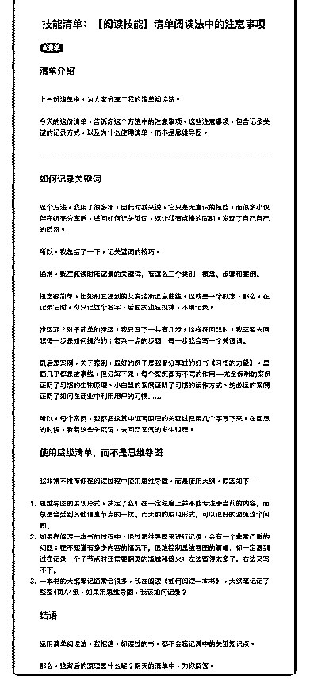

# 42.

《

《20190102 清单阅读法中的注意事项》

【清单介绍】 上一份清单中，为大家分享了我的清单阅读法。

今天的这份清单，告诉你这个方法中的注意事项。这些注意事项，包含记录关 键的记录方式，以及为什么使用清单，而不是思维导图。

---

【如何记录关键词】

这个方法，我用了很多年，因此对我来说，它只是无意识的技能，而很多小伙 伴在听完分享后，提问如何记关键词，这让我有点懵的同时，发现了自己自己 的疏忽。

所以，我总结了一下，记关键词的技巧。 通常，**我在阅读时所记录的关键词，有这么三个类别：概念、步骤和案例。

**

概念很简单，比如前面提到的艾宾浩斯遗忘曲线，这就是一个概念，那么，在 记录它时，你只记这个名字，后面的遗忘规律，不用记录。

步骤呢？对于简单的步骤，我只写下一共有几步，这样在回想时，我需要去回 想每一步是如何操作的；复杂一点的步骤，每一步我会写一个关键词。

最后是案例，关于案例，最好的例子是我曾分享过的好书《习惯的力量》，里 面几乎都是故事线，但分解下来，每个案例都有不同的作用——尤金保利的案 例证明了习惯的生物原理、小白鼠的案例证明了习惯的运作方式、纺必适的案 例证明了如何在商业中利用用户的习惯……

所以，每个案例，我都把这其中证明原理的关键过程用几个字写下来。在回想 的时候，看着这些关键词，去回想案例的发生过程。

【使用层级清单，而不是思维导图】 我非常不推荐你在阅读过程中使用思维导图，而是使用大纲，原因如下——

1\. 思维导图的展现形式，决定了我们**在一定程度上并不能专注于当前的内容

**，而总是会受到其他信息节点的干扰。而大纲的展现形式，可以很好的避免

这个问题。

2\. 如果在阅读一本书的过程中，通过思维导图来进行记录，会有一个非常严重 的问题：**在不知道有多少内容的情况下，很难控制思维导图的篇幅**，你一 定遇到过在记录一个子节点时还需要翻页的尴尬和恼火：左边留得太多了，右

边又写不下。

3\. 一本书的大纲笔记通常会很多，我在阅读《如何阅读一本书》，大纲笔记记 了整整 4 页 A4 纸，如果用思维导图，我该如何记录？

【结语】 运用清单阅读法，我相信，你读过的书，都不会忘记其中的关键知识点。 那么，这背后的原理是什么呢？明天的清单中，为你解答。

评论：

