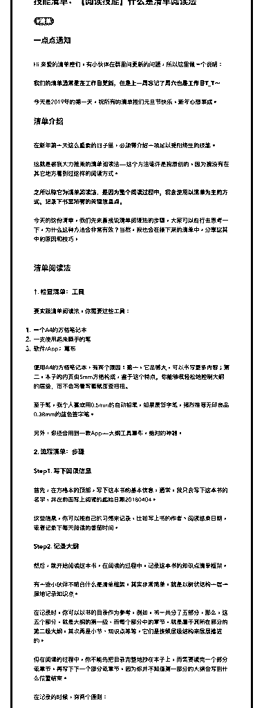
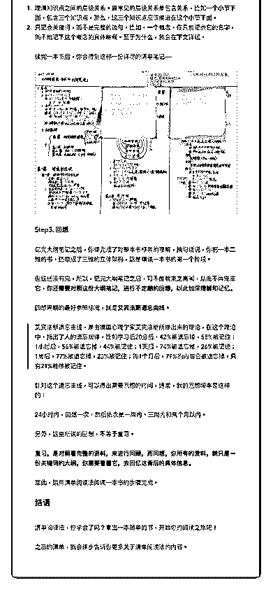

# 43.

《

《20190101 什么是清单阅读法》

【清单介绍】

在新年第一天这么重要的日子里，必须得介绍一项足以受用终生的技能。 这就是被我大力推崇的清单阅读法——这个方法或许是我原创的，因为我没有

在其它地方看到过这样的阅读方式。

**之所以称它为清单阅读法，是因为整个阅读过程中，我会使用以清单为主的 方式，记录下书里所有的关键信息点。**

今天的这份清单，我们先来直接说清单阅读法的步骤，大家可以自行去思考一 下，为什么这种方法会非常有效？当然，我也会在接下来的清单中，分享这其 中的原因和技巧。

【清单阅读法】

〖1\. 检查清单：工具〗 要实践清单阅读法，你需要这些工具： 1\. 一个 A4 的方格笔记本

2\. 一支使用起来顺手的笔

3\. 软件/App：幕布

使用 A4 的方格笔记本，有两个原因：第一，它足够大，可以书写更多内容； 第二，本子的内页由 5mm 方格构成，鉴于这个特点，你能够很轻松地控制大纲 的层级，而不会写着写着就歪歪扭扭。

至于笔，我个人喜欢用 0.5mm 的自动铅笔，如果是签字笔，强烈推荐无印良品

0.38mm 的蓝色签字笔。

另外，你还会用到一款 App——大纲工具幕布，绝对的神器。

〖2\. 流程清单：步骤〗

〖Step1\. 写下阅读信息〗 首先，在方格本的顶部，写下这本书的基本信息，通常，我只会写下这本书的

名字，并在前面写上阅读的起始日期 20180404。

这些信息，你可以按自己的习惯来记录，比如写上书的作者、阅读结束日期， 或者记录下每天阅读的番茄时间。

〖Step2\. 记录大纲〗 然后，就开始阅读这本书，在阅读的过程中，记录这本书的知识点清单框架。 有一些小伙伴不明白什么是清单框架，其实非常简单，就是以树状结构一层一

层地记录知识点。

在记录时，你可以以书的目录作为参考，例如，书一共分了五部分，那么，这 五个部分，就是大纲的第一级，而每个部分中的章节，就是属于其所在部分的 第二级大纲，其次再是小节、知识点等等，它们是按照层级结构来层层推进 的。

但在阅读的过程中，你不能先把目录完整地抄在本子上，而需要读完一个部分 或章节，再写下下一个部分或章节，因为你并不知道第一部分的大纲会写到什 么位置结束。

在记录的时候，有两个原则：

1\. 理清知识点之间的层级关系。最常见的层级关系是包含关系，比如一个小节 下面，包含三个知识点，那么，这三个知识点应该缩进在这个小节下面。

2\. 只记录关键词，而不是完整的语句。比如，一个概念，你只能记录它的名 字，而不能记下这个概念的具体解释。至于为什么，我会在下文详述。

读完一本书后，你会得到这样一份详尽的清单笔记—— [image:952B5349-A3CC-4F6A-8557-E55DCFFDBC95-1197-

0000426BC65DE2A8/大纲读书笔记.png]

〖Step3\. 回想〗 记完大纲笔记之后，你便完成了对整本书框架的理解，换句话说，你把一本二

维的书，还原成了三维的立体架构，这是精读一本书的第一个阶段。

但这还没有完，所以，记完大纲笔记之后，可不能就束之高阁，从此不再宠幸 它，**你还需要对照这份大纲笔记，进行不定期的回想，以此加深理解和记 忆。**

回想周期的最好参照标准，就是**艾宾浩斯遗忘曲线**。

> 艾宾浩斯遗忘曲线，是由德国心理学家艾宾浩斯所提出来的理论，在这个理 论中，指出了人的遗忘规律，比如学习后 20 分后，42%被遗忘掉，58%被记 住；1 小时后，56%被遗忘掉，44%被记住；1 天后，74%被遗忘掉，26%被记 住；1 周后，77%被遗忘掉，23%被记住；而 1 个月后，79%的内容会被遗忘 掉，只有 21%能够被记住。

针对这个遗忘曲线，可以得出需要回想的时间，通常，我的回想频率是这样 的：

24 小时内，回想一次，然后依次是一周内、三周内和两个月以内。 另外，这里所说的回想，不等于复习。

**复习，是对照着完整的资料，来进行回顾，而回想，你所有的资料，就只是 一份关键词的大纲，你需要看着它，去回忆这背后的具体信息。**

至此，运用清单阅读法阅读一本书的步骤完成。

【结语】 清单阅读法，你学会了吗？拿出一本简单的书，开始你的阅读之旅吧！ 之后的清单，我会逐步告诉你更多关于清单阅读法的内容。

评论：

