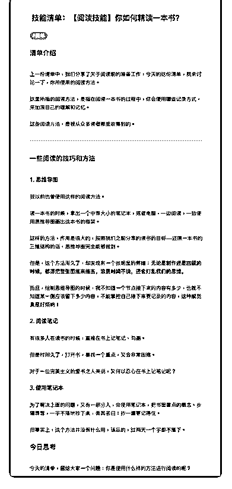

# 44.

《

《20181228 你如何精读一本书？》

【清单介绍】

上一份清单中，我们分享了关于阅读前的准备工作，今天的这份清单，就来讨 论一下，你所使用的阅读方法。

这里所指的阅读方法，是指在阅读一本书的过程中，你会使用哪些记录方式， 来加深自己的理解和记忆。

这些阅读方法，是我从众多读者那里收集到的。

---

【一些阅读的技巧和方法】

〖1\. 思维导图〗 我以前也曾使用这样的阅读方法。

读一本书的时候，拿出一个中等大小的笔记本，或者电脑，一边阅读，一边使 用思维导图画出这本书的框架。

这样的方法，作用是很大的，按照我们之前分享的读书的目标——还原一本书 的三维结构的话，思维导图完全能够做到。

但是，这个方法用久了，却发现有一个很明显的弊端：**无论是制作还是回顾 的时候，都得把整张图拖来拖去，浪费时间不说，还会打乱我们的思维。**

而且，绘制思维导图的时候，我不知道一个节点接下来的内容有多少，也就不 知道某一侧应该留下多少内容，不能掌控自己接下来要记录的内容，这种感觉 真是好烦呐！

〖2\. 阅读笔记〗 有很多人在读书的时候，直接在书上记笔记、勾画。 但是时间久了，打开书，要找一个重点，又会非常困难。 对于一位完美主义的爱书之人来说，又何以忍心在书上记笔记呢？

〖3\. 使用笔记本〗 为了解决上面的问题，又有一部分人，会使用笔记本，把书里重点的概念、步

骤等等，一字不落地抄下来，美其名曰：抄一遍更记得住。

但事实上，这个方法并没有什么用，该忘的，过两天一个字都不落下。

【今日思考】 今天的清单，留给大家一个问题：你是使用什么样的方法进行阅读的呢？

评论：

