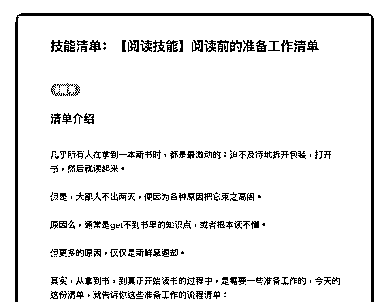
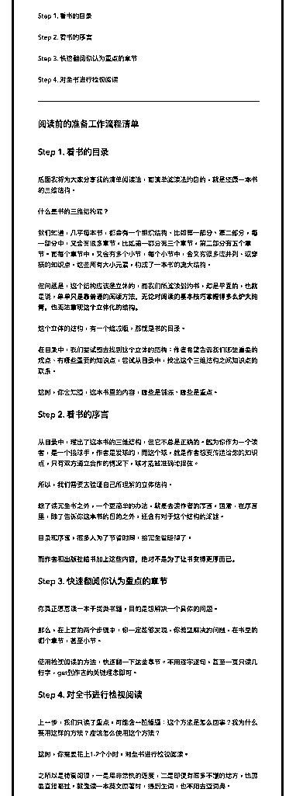
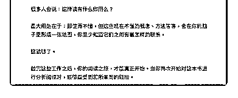

# 45.

《

《20181227 阅读前的准备工作清单》

【清单介绍】

几乎所有人在拿到一本新书时，都是最激动的：迫不及待地拆开包装，打开 书，然后就读起来。

但是，大部人不出两天，便因为各种原因把它束之高阁。 原因么，通常是 get 不到书里的知识点，或者根本读不懂。 但更多的原因，仅仅是新鲜感退却。 其实，从拿到书，到真正开始读书的过程中，是需要一些准备工作的，今天的

这份清单，就告诉你这些准备工作的流程清单：

Step 1\. 看书的目录

Step 2\. 看书的序言

Step 3\. 快速翻阅你认为重点的章节

Step 4\. 对全书进行检视阅读

---

【阅读前的准备工作流程清单】

【Step 1\. 看书的目录】 后面我将为大家分享我的清单阅读法，而清单阅读法的目的，就是还原一本书

的三维结构。

什么是书的三维结构呢？ 我们知道，几乎每本书，都会有一个组织结构，比如第一部分、第二部分，每

一部分中，又会有很多章节，比如第一部分有三个章节，第二部分有五个章

节。而每个章节中，又会有多个小节，每个小节中，会又有很多或并列、或穿

插的知识点。这些所有大小元素，构成了一本书的庞大结构。

但问题是，这个结构应该是立体的，而我们所阅读到的书，却是平面的，也就 是说，**单单只是靠普通的阅读方法，无论对阅读的基本技巧掌握得多么炉火 纯青，也无法重现这个立体化的结构。**

这个立体的结构，有一个缩减版，那就是书的目录。 在目录中，我们要试图去找到这个立体的结构：作者希望告诉我们哪些重要的

观点、有哪些重要的知识点，尝试从目录中，找出这个三维结构之间知识点的

联系。

这时，你会知道，这本书里的内容，哪些是铺陈、哪些是重点。

【Step 2\. 看书的序言】 从目录中，理出了这本书的三维结构，但它不总是正确的。因为你作为一个读

者，是一个接球手，作者是发球的，而这个球，就是作者想要传递给你的知识

点，只有双方通立合作的情况下，球才能被准确地接住。

所以，我们需要去验证自己所理解的立体结构。

除了读完全书之外，一个更简单的办法，就是去读作者的序言，通常，在序言 里，除了告诉你这本书的目的之外，还会有对于这个结构的阐述。

目录和序言，很多人为了节省时间，给完全省略掉了。

**而作者和出版社给书加上这些内容，绝对不是为了让书变得更厚而已。**

【Step 3\. 快速翻阅你认为重点的章节】 你真正愿意读一本干货类书籍，目的是想解决一个具体的问题。

那么，在上面的两个步骤中，你一定能够发现，你希望解决的问题，在书里的 哪个章节，甚至小节。

使用检视阅读的方法，快速翻一下这些章节。不用逐字逐句，甚至一页只读几 行字，get 到作者的关键理念即可。

【Step 4\. 对全书进行检视阅读】 上一步，我们只读了重点，可能会一脸懵逼：这个方法是怎么回事？我为什么

要用这样的方法？应该怎么使用这个方法？

这时，你需要花上 1-2 个小时，对全书进行检视阅读。 之所以是检查阅读，一是用非常快的速度，二是即使有很多不懂的地方，也需

要直接略过。就像读一本英文原著时，遇到生词，也不用去查词典。

很多人会说：这样读有什么卵用么？ 最大用处在于：即使弄不懂，但这些现在不懂的概念、方法等等，会在你的脑

子里形成一张地图，你至少知道它们之间有着怎样的联系。

这就够了。 做完这些工作之后，你的阅读之旅，才能真正开始。当你再次开始对这本书进

行分析阅读时，能够感受到前所未有的轻松。

评论：

