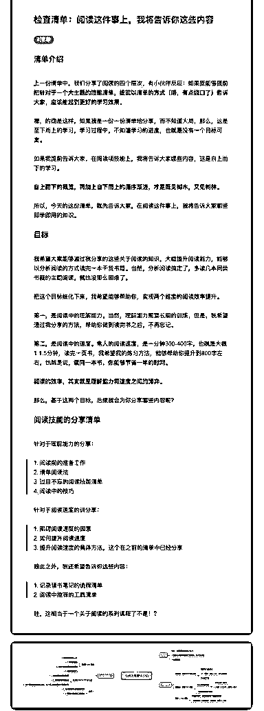

# 46.

《20181226 阅读这件事上，我将告诉你这些内容》

【版本记录】

1\. 2018-12-26，文章发布。

2\. 2018-12-27，针对未来的内容规划，更新了思维导图，思维导图由群友“101

正在输入”制作，这是第一次提供分享的热心小伙伴，有奖品！

【清单介绍】

上一份清单中，我们分享了阅读的四个层次，有小伙伴反应：**如果我能够提 前把针对于一个大主题的技能清单，提前以清单的方式（唔，有点绕口了）告 诉大家，应该能起到更好的学习效果。**

嗯，的确是这样，如果我是一份一份清单地分享，而不知道大局，那么，这是 至下而上的学习，学习过程中，不知道学习的进度，也就是没有一个目标可 言。

如果我提前告诉大家，在阅读项技能上，我将告诉大家哪些内容，这是自上而 下的学习。

**自上而下的概览，再加上自下而上的循序渐进，才是既见树木，又见树林。

**

所以，今天的这份清单，就先告诉大家，在阅读这件事上，我将告诉大家哪些 即学即用的知识。

【目标】 我希望大家能够通过我分享的这些关于阅读的知识，大幅提升阅读能力，能够

以分析阅读的方式读完一本干货书籍。当然，分析阅读搞定了，多读几本同类

书籍的主题阅读，就也没那么困难了。

把这个目标细化下来，我希望能够帮助你，实现两个维度的阅读效率提升。 第一，是阅读中的理解能力。当然，理解能力需要长期的训练，但是，我希望

通过我分享的方法，帮助你做到读完书之后，不再忘记。

第二，是阅读中的速度。常人的阅读速度，是一分钟 300-400 字，也就是大概 1-1.5 分钟，读完一页书，我希望我的练习方法，能够帮助你提升到 800 字左 右，也就是说，**读同一本书，你能够节省一半的时间。**

**阅读的效率，其实就是理解能力和速度之间的博弈。**

那么，基于这两个目标，后续我会为你分享哪些内容呢？

【 阅读技能的分享清单】 针对于理解能力的分享：

> 1\. 阅读前的准备工作

> 2\. 清单阅读法

> 3\. 过目不忘的阅读技能清单

> 4\. 阅读中的技巧

针对于阅读速度的训分享：

> 1\. 阻碍阅读速度的因素

> 2\. 如何提升阅读速度

> 3\. 提升阅读速度的具体方法，这个在之前的清单中已经分享

除此之外，我还希望告诉你这些内容：

> 1\. 记录读书笔记的流程清单

> 2\. 阅读中推荐的工具清单

哇，这相当于一个关于阅读的系列课程了不是！？ 评论：

