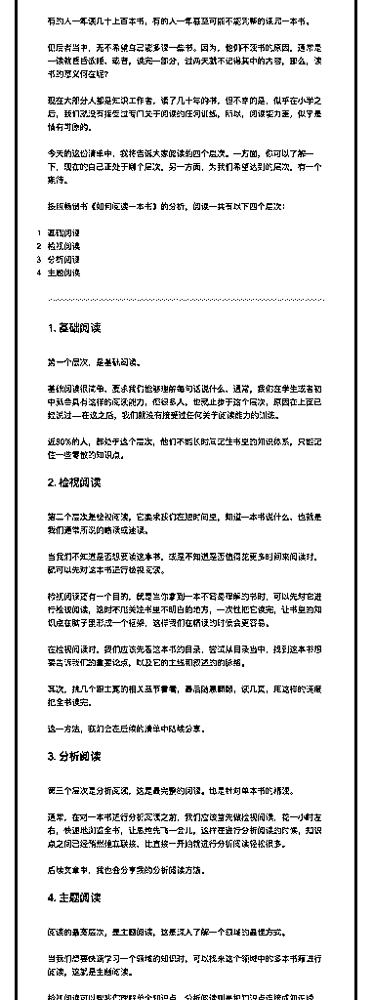

# 47.

《

《20181225 阅读的四个层次》

【清单介绍】 今天开始，为大家分享第一项重要的元技能：阅读。

我们都知道，在工作和学习中，阅读是一项很重要的技能；而在生活中，阅读 也是一项饱受赞誉的习惯——如果你告诉别人自己一年读几十本书，别人一定 会刮目相看。

但是，阅读这件事，也是讲究能力高低的。 有的人一年读几十上百本书，有的人一年甚至可能不能完整的读完一本书。 但后者当中，无不希望自己能多读一些书。因为，他们不读书的原因，通常是

一读就昏昏欲睡，或者，读完一部分，过两天就不记得其中的内容，那么，读

书的意义何在呢？

现在大部分人都是知识工作者，读了几十年的书，但不幸的是，似乎在小学之 后，我们就没有接受过专门关于阅读的任何训练，所以，阅读能力差，似乎是 情有可原的。

今天的这份清单中，我将告诉大家阅读的四个层次。一方面，你可以了解一 下，现在的自己正处于哪个层次，另一方面，为我们希望达到的层次，有一个 期待。

按照畅销书《如何阅读一本书》的分析，阅读一共有以下四个层次：

1\. 基础阅读

2\. 检视阅读

3\. 分析阅读

4\. 主题阅读

---

【1\. 基础阅读】 第一个层次，是基础阅读。

基础阅读很简单，要求我们能够理解每句话说什么，通常，我们在学生或者初 中就会具有这样的阅读能力，但很多人，也就止步于这个层次，原因在上面已 经说过——在这之后，我们就没有接受过任何关于阅读能力的训练。

近 80%的人，都处于这个层次，他们不能长时间记住书里的知识体系，只能记 住一些零散的知识点。

【2\. 检视阅读】 第二个层次是检视阅读，它要求我们在短时间里，知道一本书说什么，也就是

我们通常所说的略读或速读。

当我们不知道是否想要读这本书，或是不知道是否值得花更多时间来阅读时， 就可以先对这本书进行检视阅读。

检视阅读还有一个目的，就是当你拿到一本不容易理解的书时，可以先对它进 行检视阅读，这时不用关注书里不明白的地方，一次性把它读完，让书里的知 识点在脑子里形成一个框架，这样我们在精读的时候会更容易。

在检视阅读时，我们应该先看这本书的目录，尝试从目录当中，找到这本书想 要告诉我们的重要论点，以及它的主线和叙述的的脉络。

其次，挑几个跟主题的相关章节看看，最后随意翻翻，读几页，用这样的速度 把全书读完。

这一方法，我们会在后续的清单中陆续分享。

【3\. 分析阅读】 第三个层次是分析阅读，这是最完整的阅读。也是针对单本书的精读。 通常，在对一本书进行分析阅读之前，我们应该首先做检视阅读，花一小时左

右，快速地浏览全书，让思维先飞一会儿，这样在进行分析阅读的时候，知识

点之间已经悄然建立联接，比直接一开始就进行分析阅读轻松很多。

后续文章中，我也会分享我的分析阅读方法。

【 4\. 主题阅读】 阅读的最高层次，是主题阅读，这是深入了解一个领域的最佳方式。 当我们想要快速学习一个领域的知识时，可以找来这个领域中的多本书籍进行

阅读，这就是主题阅读。

检视阅读可以帮我们理解单个知识点，分析阅读则是把知识点连接成知识线， 而主题阅读，则是把把知识线串连成知识网。

【今日问题】 那么，你现在处于哪个阅读的层次呢？

评论：

