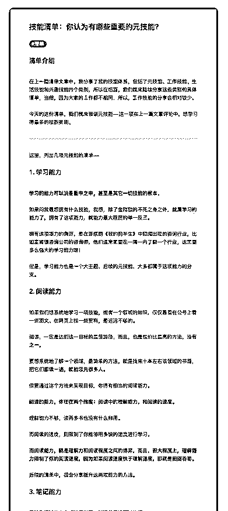
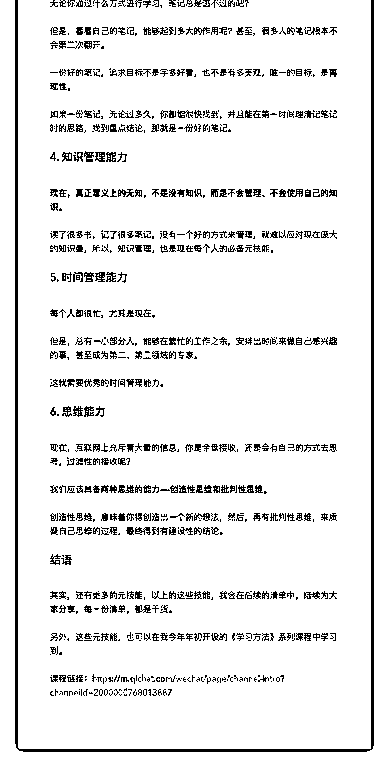
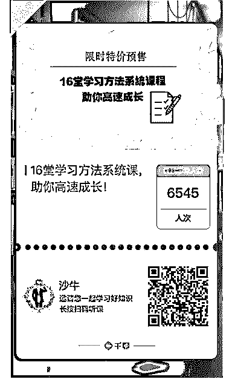

# 48.

《

《20181224 你认为有哪些重要的元技能？》

【清单介绍】

在上一篇清单文章中，我分享了我的技能体系，包括了元技能、工作技能、生 活技能和兴趣技能四个类别，所以在后面，我们就来陆续分享这些类别的具体 清单，当然，因为大家的工作都不相同，所以，工作技能的分享会相对较少。

今天的这份清单，我们就来谈谈元技能——这一项在上一篇文章评论中，想学 习得最多的技能类别。

---

这里，列出几项元技能的清单——

【1\. 学习能力】

**学习的能力可以说是重中之中，甚至是其它一切技能的根本。**

如果问我最想拥有什么技能，我想，除了金刚狼的不死之身之外，就属学习的 能力了，拥有了这项能力，就能力最大程度的举一反三。

拥有这项能力的典范，是在连续剧《我的前半生》中频频出现的咨询行业，比 如麦肯锡咨询公司的咨询师，他们通常需要在一周一内了解一个行业，这需要 多么强大的学习能力呀！

但是，学习能力也是一个大主题，后续的元技能，大多都属于这项能力的分 支。

【2\. 阅读能力】 如果我们想系统地学习一项技能，或者一个领域的知识，仅仅靠看在公号上看

一些图文、在网页上找一些资料，是远远不够的。

阅读，一定是达到这一目标的最佳路径，而且，也是性价比最高的方法，没有 之一。

要想系统地了解一个领域，最简单的方法，就是找来十本左右该领域的书籍， 把它们都读一遍，就能领先很多人。

但要通过这个方法来实现目标，你得有相当的阅读能力。

**阅读的能力，体现在两个维度：阅读中的理解能力，和阅读的速度。**

理解能力不够，读再多书也没有什么卵用。

而阅读的速度，则限制了你能够用多快的速度进行学习。

**而阅读能力，就是理解力和阅读程度之间的博弈，而且，很大程度上，理解 能力限制了你的阅读速度，因为如果阅读速度快于理解速度，那就是囫囵吞 枣。**

后续的清单中，我会分享提升这两项能力的方法。

【3\. 笔记能力】 无论你通过什么方式进行学习，笔记总是逃不过的吧？

但是，看看自己的笔记，能够起到多大的作用呢？甚至，很多人的笔记根本不 会第二次翻开。

一份好的笔记，追求目标不是字多好看，也不是有多美观，唯一的目标，是** 再现性**。

如果一份笔记，无论过多久，你都能很快找到，并且能在第一时间理清记笔记 时的思路，找到重点结论，那就是一份好的笔记。

【4\. 知识管理能力】

**现在，真正意义上的无知，不是没有知识，而是不会管理、不会使用自己的 知识。**

读了很多书，记了很多笔记，没有一个好的方式来管理，就难以应对现在庞大 的知识量，所以，知识管理，也是现在每个人的必备元技能。

【5\. 时间管理能力】 每个人都很忙，尤其是现在。

但是，总有一小部分人，能够在繁忙的工作之余，安排出时间来做自己感兴趣 的事，甚至成为第二、第三领域的专家。

这就需要优秀的时间管理能力。

【6\. 思维能力】 现在，互联网上充斥着大量的信息，你是全盘接收，还是会有自己的方式去思

考，过滤性的接收呢？

我们应该具备**两种思维的能力——创造性思维和批判性思维。** 创造性思维，意味着你得创造出一个新的想法，然后，再有批判性思维，来质

疑自己思维的过程，最终得到有建设性的结论。

【结语】 其实，还有更多的元技能，以上的这些技能，我会在后续的清单中，陆续为大

家分享，每一份清单，都是干货。

另外，这些元技能，也可以在我今年年初开设的《学习方法》系列课程中学习 到。

[课程链接：](https://m.qlchat.com/wechat/page/channel-intro?channelId=2000000768013887)[`m.qlchat.com/wechat/page/channel-intro?`](https://m.qlchat.com/wechat/page/channel-intro?channelId=2000000768013887)  [channelId=2000000768013887](https://m.qlchat.com/wechat/page/channel-intro?channelId=2000000768013887)

评论：

