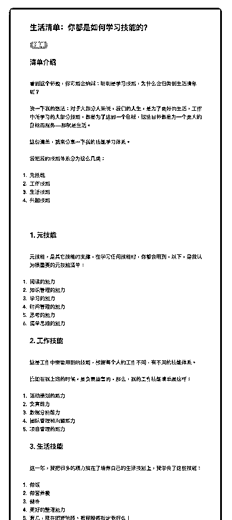
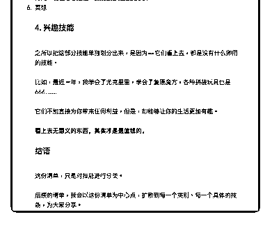

# 49.

《

《20181221 你都是如何学习技能的？》

【清单介绍】

看到这个标题，你可能会纳闷：明明是学习技能，为什么会归类到生活清单 呢？

说一下我的想法：对于大部分人来说，我们的人生，是为了更好的生活，工作 中所学习的大部分技能，都是为了达到一个目标，这些目标都是为一个更大的 目标而服务——那就是生活。

这份清单，就来分享一下我的技能学习体系。 我把我的技能体系分为这么几类：

1\. 元技能

2\. 工作技能

3\. 生活技能

4\. 兴趣技能

---

【1\. 元技能】 元技能，是其它技能的支撑，在学习任何技能时，你都会用到，以下，是我认

为很重要的元技能清单：

1\. 阅读的能力

2\. 知识管理的能力

3\. 学习的能力

4\. 时间管理的能力

5\. 思考的能力

6\. 清单思维的能力

【2\. 工作技能】 这是工作中需要用到的技能，根据每个人的工作不同，有不同的技能体系。 比如在我上班的时候，是负责运营的，那么，我的工作技能清单是这样：

1\. 活动策划的能力

2\. 文案能力

3\. 数据分析能力

4\. 团队管理和沟通能力

5\. 项目管理的能力

【3\. 生活技能】 这一年，我把很多的精力放在了培养自己的生活技能上，我学会了这些技能：

1\. 做饭

2\. 做营养餐

3\. 健身

4\. 更好的整理能力

5\. 育儿，现在嘟嘟陪睡、擦屁股都指定我好么！

6\. 冥想

【4\. 兴趣技能】 之所以把这部分技能单独划分出来，是因为——它们看上去，都是没有什么卵

用的技能。

比如，最近一年，我学会了尤克里里，学会了复原魔方，各种拼装玩具也是

666……

它们不能直接为你带来任何利益，但是，却能够让你的生活更加有趣。

**看上去无意义的东西，其实才是最值钱的。**

【结语】

这份清单，只是对技能进行分类。

后续的清单，我会以这份清单为中心点，扩散到每一个类别、每一个具体的技 能，为大家分享。

评论：

