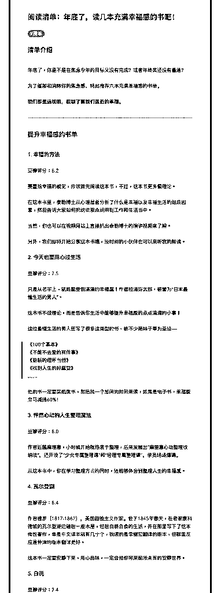
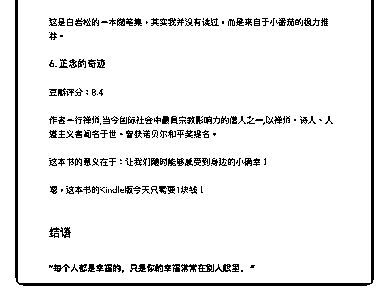

# 50.

《20181220 年底了，读几本充满幸福感的书吧！》

【清单介绍】 年底了，你是不是在焦虑今年的目标又没有完成？或者年终奖还没有着落？ 为了缓解和消除你的焦虑感，特此推荐六本充满幸福感的书单。

**我们都是远视眼，模糊了离我们最近的幸福。**

---

【提升幸福感的书单】

〖1\. 幸福的方法〗 豆瓣评分：8.2

要重拾幸福的感觉，应该首先阅读这本书，不过，这本书更多偏理论。

在这本书里，泰勒博士从心理层面分析了什么是幸福以及幸福生活的组成因 素，然后告诉大家如何把这些观点运用到工作和生活当中。

当然，你也可以在视频网站上直接扒出泰勒博士的演讲视频来了解。 另外，我们即将开始分享这本书哦，没时间的小伙伴也可以来听我的解读。

〖2\. 今天也要用心过生活〗 豆瓣评分：7.5

只是从名字上，就能感受到满满的幸福感！作者松浦弥太郎，被誉为“日本最 懂生活的男人”。

这本书不谈理论，而是告诉你生活中能够提升幸福感的点点滴滴的小事！

这位最懂生活的男人还写了很多这类型的书，被不少萌妹子奉为圣经——

> 《100 个基本》

> 《不能不去爱的两件事》

> 《崭新的理所当然》

> 《找到人生的好感觉》

> ……

他的书一定要买纸质书，然后找一个悠闲的时间来读，如果是电子书，幸福感 立马减掉 60%！

〖3\. 怦然心动的人生整理魔法〗 豆瓣评分：8.0

作者近藤麻理惠，小时候开始就热衷于整理，后来发展出“麻里惠心动整理收 纳法”，还开设了“少女专属整理课”和“经理专属整理课”，学员场场爆满。

从这本书中，你在学习整理方式的同时，还能够体会到整理人生的幸福感。

〖4\. 瓦尔登湖〗 豆瓣评分：8.4

作者梭罗（1817-1862），美国超验主义作家。他于 1845 年春天，在老家康科 德城的瓦尔登湖边建起一座木屋，过起自耕自食的生活，并在那里写下了这本 传世著作，单是中文译本就有几十个，我读的是李继宏翻译的版本，但群里反 应是仲泽的版本翻译更好。

这本书一定要安静下来，用心品味，一定会给你带来前所未有的安静世界。

〖5\. 白说〗 豆瓣评分：7.4

这是白岩松的一本随笔集，其实我并没有读过，而是来自于小番茄的极力推 荐。

〖 6\. 正念的奇迹〗 豆瓣评分：8.4

作者一行禅师,当今国际社会中最具宗教影响力的僧人之一,以禅师、诗人、人 道主义者闻名于世。曾获诺贝尔和平奖提名。

这本书的意义在于：让我们随时能够感受到身边的小确幸！

【结语】

**“每个人都是幸福的，只是你的幸福常常在别人眼里。 ”**

评论：

