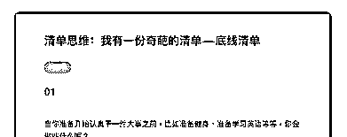
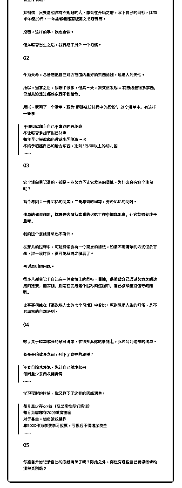

# 51.

《

《20181219 我有一份奇葩的清单——底线清单》

【01】 当你准备开始认真干一件大事之前，比如准备健身、准备学习英语等等，你会

做些什么呢？

我相信，只要是稍微有点规划的人，都会在开始之前，写下自己的目标，比如 半年瘦 20 斤、一年能够看懂原版英文书籍等等。

没错，这样的事，我也会做。 但从嘟嘟出生之后，我养成了另外一个习惯。

【02】 作为父母，总是想把自己能力范围内最好的东西给娃，这是人的天性。

所以，当爹之后，我想了很多，但某一天，我突然发现——**我想给他很多东 西，但却从没想过哪些东西不能给他。**

所以，我列了一个清单，取为“嘟嘟成长过程中的底线”，这个清单中，有这样 一些事——

> 不强迫嘟嘟上自己不喜欢的兴趣班

> 不让嘟嘟参加节假日补课

> 每年至少带嘟嘟出省或出国旅游一次

> 不给予超越自己的能力东西，比如 5 万/年以上的幼儿园

> ……

【03】

这个清单里记录的，都是一些努力不让它发生的事情，为什么会有这个清单 呢？

两个原因：一是记忆的问题，二是原则的问题，先说记忆的问题。

**清单的最大作用，就是将大脑从繁重的记忆工作中解释出来，让它能够专注 于思考。**

我的这个底线清单也不例外。 在育儿的过程中，可能经常会有一个突发的想法，如果不用清单的方式记录下

来，过一段时间，很可能就抛之脑后了。

再说原则的问题。 很多人都会记下自己在一件事情上的目标，**目标，是希望自己通过努力之后

达成的愿景，而底线，则是在完成这个目标的过程中，自己必须坚持恪守的原

则。**

史蒂芬柯维在《高效能人士的七个习惯》中曾说：原则就是人生的灯塔，是不 容动摇的自然法则。

【04】 除了关于嘟嘟成长的底线清单，在很多其他的事情上，我也会列这样的清单。 我在开始健身之前，列下了这样的底线：

> 不盲目追求减肥，先让自己健康起来

> 每周至少去两次健身房

> ……

学习理财的时候，我又列下了这样的底线清单：

> 每月至少存 xxx 钱（写出来怕你们笑话）

> 每月为嘟嘟存 2000 教育基金

> 对于基金，切勿波段操作

> 拿 5000 作为学费学习股票，亏损后不得增加资金

> ……

【05】 你准备开始记录自己的底线清单了吗？除此之外，你还有哪些自己觉得很棒的

清单类别呢？

评论：

