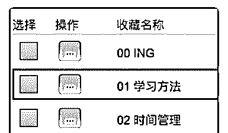
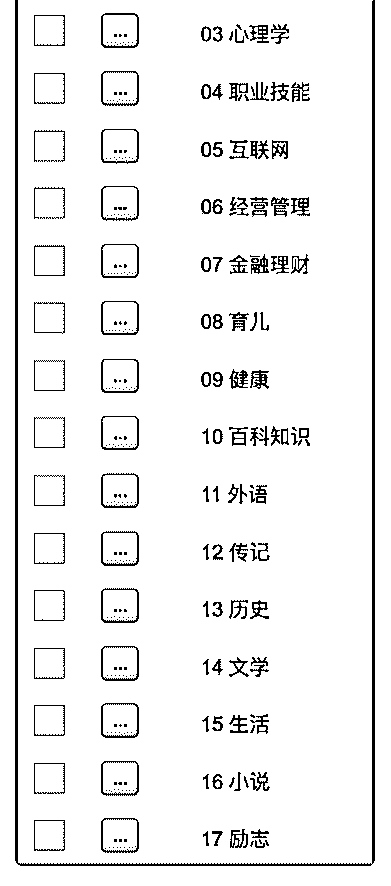

# 52.

《

《20181218 写给所有有 Kindle 的人——我如何整理我的 Kindle 收藏夹》

【清单介绍】

我一年的阅读量，大概是 100 本书。这些书中，70%都是电子书，因为电子书 更方便整理书摘。

而我的主力阅读设备，正是大名鼎鼎的 Kindle。我在 Kindle 上买了近 500 本书

——

[图片] 那么问题来了，如何妥善地管理这些书呢？这是一个大问题。 这份清单，就是告诉你我的 Kindle 收藏夹整理方法。

【整理成果】

我前后共花费 5 个番茄时间，整理后，共有 18 个新的收藏夹，每个收藏夹的书 控制在 20 本左右，多的不超过 50 本。

整理之后，最大的好处是有了更细致的分类，我的书籍中，个人提升的书最 多，之前就一个收藏夹——个人提升，这一次，我把像这样的收藏夹细分成了 多个，比如之前的个人提升，这一次细分成了时间管理、学习方法、思维方 式、职业技能、心理学等等。

【整理的步骤清单】

〖Step1\. 规划〗 对于一件比较复杂的事，或是整理类的工作，我向来喜欢事先做好规划，以免

整理的过程中因为遗漏某个元素或步骤，让工作更加复杂化。

所以，在这之前，我在方格本上记下了这些内容—— [图片]

首先，是目标——通过这次整理，我希望达到什么目标，这是支撑下一步行动 的基础。

然后，把现在的收藏夹列出来，哪些收藏夹里的书多得过分了，那么，就把这 个收藏夹细分。

接着，再思考一下，在细分后的收藏夹列表中，是否有遗漏掉的，然后，这些 新的收藏夹，会形成一个列表，再根据重要程度加上序号。

加序号的目的，是因为 Kindle 上会根据这些序号来排序，越小的数字会越靠 前，所以，我用这样的数字，来让对自己更重要的书籍类别靠前。

那么，为什么会使用 01、02 这样的编号，而不是直接使用 1、2、3？

因为，如果使用后者，很多设备（不只是 Kindle）都会把 11 放在 2 的前面，因 为 Kindle 不知道 11 更大，应该靠后，而如果在前面加个 0，就可以控制顺序 了。

〖Step2\. 预估整理流程〗 其实，最重要的工作在第一步就完成了，接下来的，就是体力活。 在开始体力活之前，我先在脑子里想了一下重新整理的流程——毕竟，500 多

本书，如果因为流程上的问题而导致返工的话，这个时间成本，是不能轻易承

受的。

最终，我记录下了这样的一个整理流程：

1\. 先在亚马逊的网页中建立收藏夹，00-18 个收藏夹全部先建立好。

2\. 同样在网页中，以 50 本为一个单位，为每本书重新设置收藏夹。

3\. 重置设备，同步新收藏夹。

大部分的工作，都花在了第二步上，差不多四个番茄时间。 最终，调整工作顺利完成。

【Kindle 收藏夹整理技巧清单】

1\. 现在 Kindle 收藏夹可以在网页里管理，比之前方便太多，如果是之前那样只 能在 Kindle 整理，我是肯定不会花这时间的。网页管理需要登录 z.cn，然后 在“管理我的内容和设备”中操作。

2\. 我的方式是一本书只属于一个收藏夹，但也可以把收藏夹当作标签来使用， 比如《乔布斯传》这本书，你可以让它属于互联网、传记等收藏夹中。

3\. 我有一个状态收藏夹，序号 00，也就是在最前面，收藏夹名称为 ING，一看 就知道，这个收藏夹是放正在阅读的书的，这个收藏夹里，通常只有 3 本书， 不超过五本，因为我一般会在同一时间段，阅读 3 本左右的书，利用这个收藏 夹，找起来比较方便。

4\. 附我的收藏夹—— [图片]

评论：

