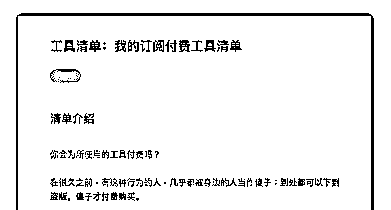
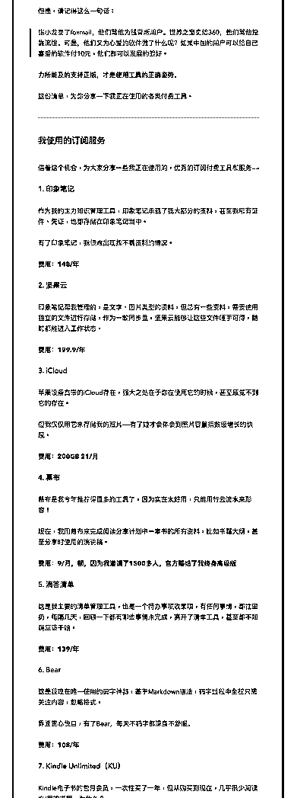
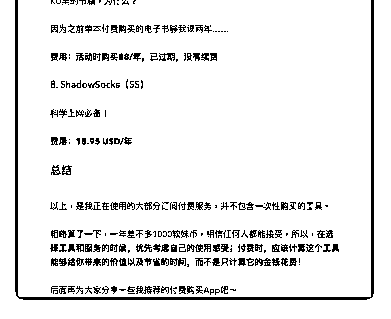

# 53.

《20181217 我的订阅付费工具清单》

【清单介绍】

你会为所使用的工具付费吗？ 在很久之前，有这种行为的人，几乎都被身边的人当作傻子：**到处都可以下

到盗版，傻子才付费购买。**

但是，请记得这么一句话：

> 张小龙卖了 foxmail，他们骂他为钱背叛用户。世界之窗卖给 360，他们骂他 投靠流氓。可是，他们又为心爱的软件做了什么呢？如果中国的用户可以给自 己喜爱的软件付 10 元，他们都可以发展的很好。

**力所能及的支持正版，才是使用工具的正确姿势。**

这份清单，为你分享一下我正在使用的各类付费工具。

---

【我使用的订阅服务】

借着这个机会，为大家分享一些我正在使用的，优秀的订阅付费工具和服务

——

〖1\. 印象笔记〗 作为我的主力知识管理工具，印象笔记承载了我大部分的资料，甚至我所有证

件、凭证，也都存储在印象笔记当中。

有了印象笔记，我很难出现找不着资料的情况。

**费用：148/年**

〖2\. 坚果云〗 印象笔记帮我管理的，是文字、图片类型的资料，但总有一些资料，需要使用

独立的文件进行存储，作为一款同步盘，坚果云能够让这些文件唾手可得，随

时都能进入工作状态。

**费用：199.9/年**

〖3\. iCloud〗 苹果设备自带的 iCloud 存在，强大之处在于你在使用它的时候，甚至感觉不到

它的存在。

但我仅仅用它来存储我的照片——有了娃才会体会到照片容量指数级增长的快 感。

**费用：200GB 21/月**

〖4\. 幕布〗 幕布是我今年推荐得最多的工具了，因为实在太好用，只能用行云流水来形

容！

现在，我用幕布来完成阅读分享计划中一本书的所有资料，比如书籍大纲，甚 至分享时使用的演讲稿。

**费用：9/月，额，因为我邀请了 1500 多人，官方赐给了我终身高级版**

〖5\. 滴答清单〗 这是我主要的清单管理工具，也是一个待办事项收集项，有任何事情，都往里

扔，每隔几天，回顾一下都有哪些事情未完成，离开了清单工具，甚至都不知

道应该干啥。

**费用：139/年**

〖 6\. Bear〗 这是我现在唯一使用的码字神器，基于 Markdown 语法，码字过程中全程只需

关注内容，忽略格式。

界面赏心悦目，有了 Bear，每天不码字都深身不舒服。

**费用：108/年**

〖7\. Kindle Unlimited（KU）〗 Kindle 电子书的包月会员，一次性买了一年，但从购买到现在，几乎很少阅读

KU 里的书籍，为什么？

因为之前单本付费购买的电子书够我读两年……

**费用：活动时购买 88/年，已过期，没有续费**

【总结】 以上，是我正在使用的大部分订阅付费服务，并不包含一次性购买的工具。 粗略算了一下，一年差不多 1000 软妹币，相信任何人都能接受，所以，**在选

择工具和服务的时候，优先考虑自己的使用感受；付费时，应该计算这个工具

能够给你带来的价值以及节省的时间，而不是只计算它的金钱花费！**

后面再为大家分享一些我推荐的付费购买 App 吧～ 评论：

