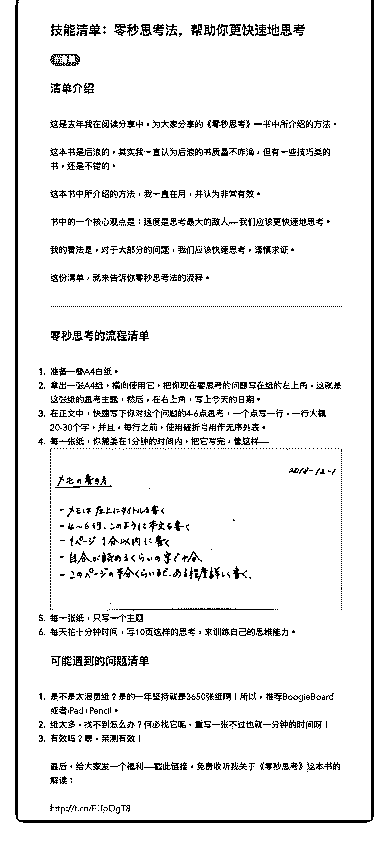

# 54.

《20181216 零秒思考法，帮助你更快速地思考》

【清单介绍】 这是去年我在阅读分享中，为大家分享的《零秒思考》一书中所介绍的方法。

这本书是后浪的，其实我一直认为后浪的书质量不咋滴，但有一些技巧类的 书，还是不错的。

这本书中所介绍的方法，我一直在用，并认为非常有效。 书中的一个核心观点是：速度是思考最大的敌人——我们应该更快速地思考。 我的看法是，对于大部分的问题，我们应该快速思考，谨慎求证。 这份清单，就来告诉你零秒思考法的流程。

---

【零秒思考的流程清单】

1\. 准备一叠 A4 白纸。

2\. 拿出一张 A4 纸，横向使用它，把你现在要思考的问题写在纸的左上角，这 就是这张纸的思考主题，然后，在右上角，写上今天的日期。

3\. 在正文中，快速写下你对这个问题的 4-6 点思考，一个点写一行，一行大概

20-30 个字，并且，每行之前，使用破折号用作无序列表。

4\. 每一张纸，你需要在 1 分钟的时间内，把它写完，像这样—— [图片]

5\. 每一张纸，只写一个主题

6\. 每天花十分钟时间，写 10 页这样的思考，来训练自己的思维能力。

【可能遇到的问题清单】

1\. 是不是太浪费纸？是的一年坚持就是 3650 张纸啊！所以，推荐 BoogieBoard 或者 iPad+Pencil。

2\. 纸太多，找不到怎么办？何必找它呢，重写一张不过也就一分钟的时间呀！

3\. 有效吗？嗯，亲测有效！ 最后，给大家发一个福利——戳此链接，免费收听我关于《零秒思考》这本书

的解读：

[`t.cn/EUpOgT8`](http://t.cn/EUpOgT8)

评论：

半旧 : 链接打开是二维码，扫描后进入不了课程改革

