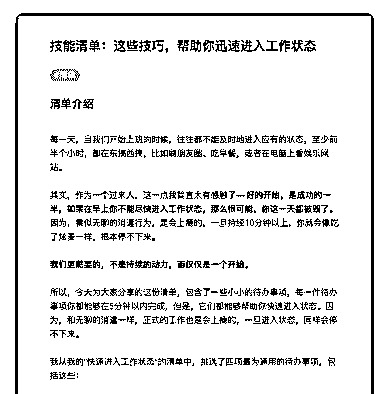
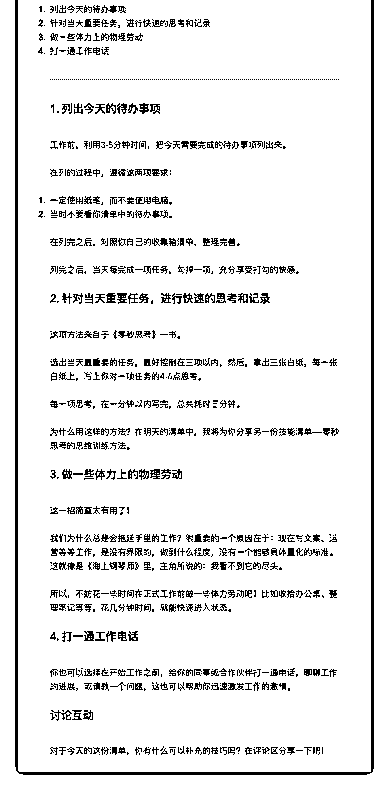

# 56.

《

《20181213 这些技巧，帮助你迅速进入工作状态》

【清单介绍】

每一天，当我们开始上班的时候，往往都不能及时地进入应有的状态，至少前 半个小时，都在东搞西搞，比如刷朋友圈、吃早餐，或者在电脑上看娱乐网 站。

其实，作为一个过来人，这一点我简直太有感触了——**好的开始，是成功的 一半，如果在早上你不能尽快进入工作状态，那么很可能，你这一天都被毁 了。**因为，看似无聊的消遣行为，是会上瘾的，一旦持续 10 分钟以上，你就 会像吃了炫麦一样，根本停不下来。

**我们更需要的，不是持续的动力，而仅仅是一个开始。**

所以，今天为大家分享的这份清单，包含了一些小小的待办事项，每一件待办 事项你都能够在 5 分钟以内完成，但是，它们都能够帮助你快速进入状态。因 为，和无聊的消遣一样，正式的工作也是会上瘾的，一旦进入状态，同样会停 不下来。

我从我的“快速进入工作状态”的清单中，挑选了四项最为通用的待办事项，包 括这些：

1\. 列出今天的待办事项

2\. 针对当天重要任务，进行快速的思考和记录

3\. 做一些体力上的物理劳动

4\. 打一通工作电话

---

【1\. 列出今天的待办事项】

工作前，利用 3-5 分钟时间，把今天需要完成的待办事项列出来。 在列的过程中，遵循这两项要求：

1\. 一定使用纸笔，而不要使用电脑。

2\. 当时不要看你清单中的待办事项。

在列完之后，对照你自己的收集箱清单，整理完善。 列完之后，当天每完成一项任务，勾掉一项，充分享受打勾的快感。

【2\. 针对当天重要任务，进行快速的思考和记录】

这项方法来自于《零秒思考》一书。

选出当天最重要的任务，最好控制在三项以内，然后，拿出三张白纸，每一张 白纸上，写上你对一项任务的 4-6 点思考。

每一项思考，在一分钟以内写完，总共耗时三分钟。 为什么用这样的方法？在明天的清单中，我将为你分享另一份技能清单——零

秒思考的思维训练方法。

【3\. 做一些体力上的物理劳动】 这一招简直太有用了！

我们为什么总是会拖延手里的工作？很重要的一个原因在于：现在写文案、运 营等等工作，是没有界限的，做到什么程度，没有一个能够具体量化的标准。 这就像是《海上钢琴师》里，主角所说的：我看不到它的尽头。

所以，不妨花一些时间在正式工作前做一些体力劳动吧！比如收拾办公桌、整 理笔记等等，花几分钟时间，就能快速进入状态。

【4\. 打一通工作电话】

你也可以选择在开始工作之前，给你的同事或合作伙伴打一通电话，聊聊工作 的进展，或请教一个问题，这也可以帮助你迅速激发工作的激情。

讨论互动 对于今天的这份清单，你有什么可以补充的技巧吗？在评论区分享一下吧！

评论：

