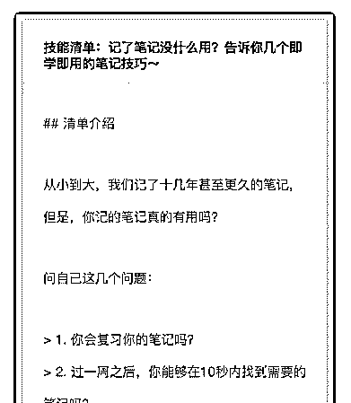
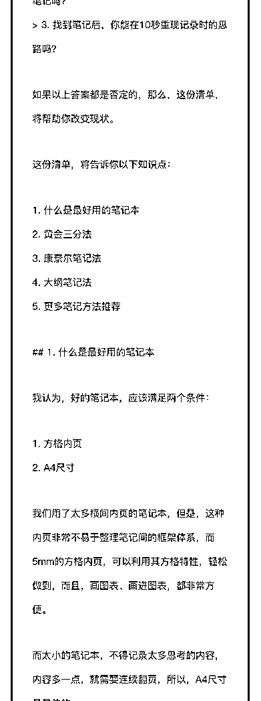
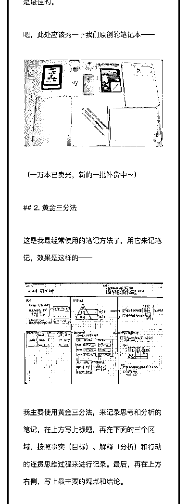
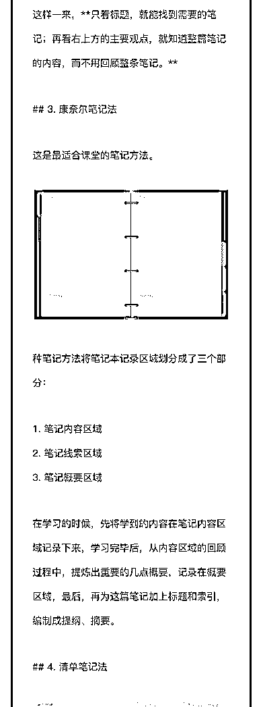
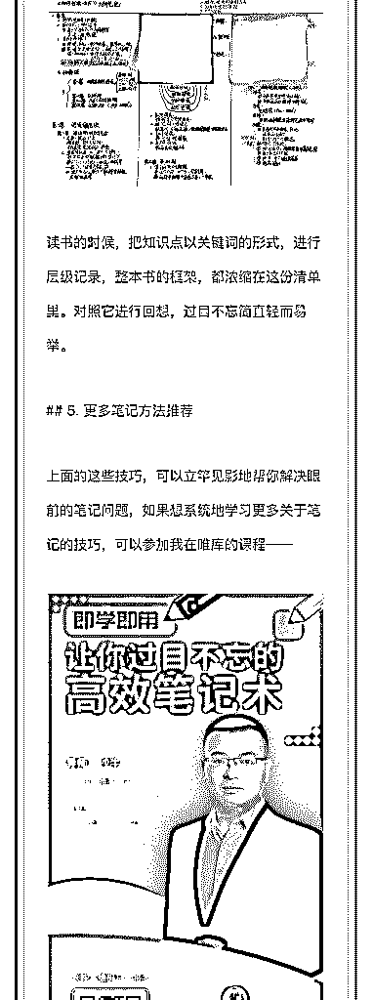
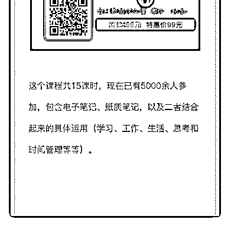

# 57.

《

《20181212 记了笔记没什么用？告诉你几个即学即用的笔记技巧～》

【清单介绍】

从小到大，我们记了十几年甚至更久的笔记，但是，你记的笔记真的有用吗？

问自己这几个问题：

1\. 你会复习你的笔记吗？

2\. 过一周之后，你能够在 10 秒内找到需要的笔记吗？

3\. 找到笔记后，你能在 10 秒重现记录时的思路吗？

如果以上答案都是否定的，那么，这份清单，将帮助你改变现状。 这份清单，将告诉你以下知识点：

什么是最好用的笔记本 黄金三分法 康奈尔笔记法 大纲笔记法 更多笔记方法推荐

【1\. 什么是最好用的笔记本】 我认为，好的笔记本，应该满足两个条件：

方格内页

A4 尺寸

我们用了太多横间内页的笔记本，但是，这种内页非常不易于整理笔记间的框 架体系，而 5mm 的方格内页，可以利用其方格特性，轻松做到，而且，画图 表、画进图表，都非常方便。

而太小的笔记本，不得记录太多思考的内容，内容多一点，就需要连续翻页， 所以，A4 尺寸是最佳的。

嗯，此处应该秀一下我们原创的笔记本——

（一万本已卖光，新的一批补货中～）

【2\. 黄金三分法】 这是我最经常使用的笔记方法了，用它来记笔记，效果是这样的——

我主要使用黄金三分法，来记录思考和分析的笔记，在上方写上标题，再在下 面的三个区域，按照事实（目标）、解释（分析）和行动的连贯思维过程来进 行记录。最后，再在上方右侧，写上最主要的观点和结论。

这样一来，只看标题，就能找到需要的笔记；再看右上方的主要观点，就知道 整篇笔记的内容，而不用回顾整条笔记。

【3\. 康奈尔笔记法】 这是最适合课堂的笔记方法。

种笔记方法将笔记本记录区域划分成了三个部分：

笔记内容区域 笔记线索区域 笔记概要区域

在学习的时候，先将学到的内容在笔记内容区域记录下来，学习完毕后，从内 容区域的回顾过程中，提炼出重要的几点概要，记录在概要区域，最后，再为 这篇笔记加上标题和索引，编制成提纲、摘要。

【4\. 清单笔记法】 这算是我原创的笔记方法了，也称为大纲笔记法。我用它来记录读书笔记。

读书的时候，把知识点以关键词的形式，进行层级记录，整本书的框架，都浓 缩在这份清单里。对照它进行回想，过目不忘简直轻而易举。

【5\. 更多笔记方法推荐】

上面的这些技巧，可以立竿见影地帮你解决眼前的笔记问题，如果想系统地学 习更多关于笔记的技巧

评论：

