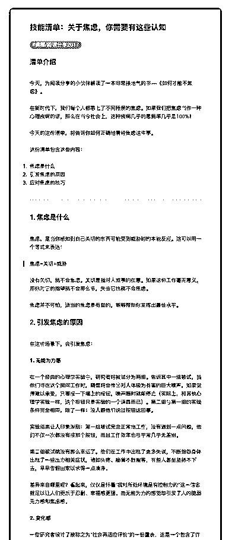
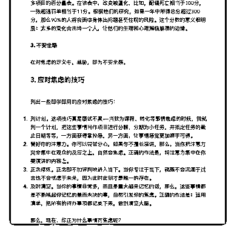

# 58.

《

《20181207 关于焦虑，你需要有这些认知》

【清单介绍】

今天，为阅读分享的小伙伴解读了一本非常接地气的书——《如何才能不焦 虑》。

在新时代下，我们每个人都患上了不同程度的焦虑。如果我们把焦虑当作一种 心理疾病的话，那么在当今社会上，这种疾病几乎的患病率几乎是 100%！

今天的这份清单，将告诉你如何正确地看待焦虑这件事。 这份清单包含这些内容：

1\. 焦虑是什么

2\. 引发焦虑的原因

3\. 应对焦虑的技巧

---

【1\. 焦虑是什么】 焦虑，是当你感知到自己关切的东西可能受到威胁时的本能反应。这可以用一

个等式来表达：

> 焦虑=关切+威胁 没有关切，就不会焦虑。关切是指对人或事的在意。如果这份工作毫无意义，

那你对它的指望就不会那么多，失去它也就不会焦虑。

焦虑并不可怕，适当的焦虑是有益的，能够帮助你发挥出最佳水平。

【2\. 引发焦虑的原因】 在这些场景下，会引发焦虑：

**1\. 无能为力感** 在一个经典的心理学实验中，研究者将被试分为两组。告诉其中一组被试，当

他们待在这个房间工作时，隔壁将会传出对人体极为有害的巨大噪声，如果觉

得难以承受，只要按一下墙上的按钮，噪声随时就能停止（实际上，和其他心

理学实验一样，这个按钮只是实验的一个道具而已）。第二组与第一组的实验

条件完全相同，除了一样：没人跟他们说过按钮这回事。

实验结果让人印象深刻：第一组被试完全正常地工作，没有遇到一点问题，他 们不仅一次都没有按那个按钮，而且工作效率也与平常几乎无差别。

第二组被试就没有那么幸运了。他们在工作中出现了更多失误，不断抱怨身体 出现了一些压力相关症状，诸如头疼、肠胃不舒服等，有些人甚至坚持不下 去，早早告假回家以求得一点清净。

差异来自哪里呢？看起来，仅仅是怀着“我对所处环境是有控制力的”这一信念 就足以让人们更乐于忍耐、幸福感更强。而无能为力的感觉却引发了人的脆弱 无力感和焦虑感。

**2\. 变化感** 一位研究者设计了被称之为“社会再适应评价”的一份量表，这是一个包含了许

多项目的百分量表。在该表中，改变被量化，比如，配偶死亡相当于 100 分，

一张超速罚单相当于 11 分。根据他们的研究，如果一年中所得总分超过 300

分，那么 90%的人将会面临身体出问题甚至住院的风险。这个分数的意义很明

显：太多的变化会击垮一个人，让他们的生理和心理濒临崩溃的边缘。

**3\. 不安全感** 在对焦虑的定义中，威胁，即为不安全感。

【3\. 应对焦虑的技巧】 列出一些即学即用的应对焦虑的技巧：

1\. 列计划。这项技巧真是屡试不爽——当我为课程、转化等事情焦虑的时候， 我就列一个计划，把这些事情当作项目进行分解，分期为小任务，并指定任务 的截止日期等等，一方面获得掌控感，另一方面，让事情感觉更加唾手可得。

2\. 管好你的注意力。你可以尝试分心，如果你不擅长演讲，那么，当你把注意 力完全集中在观众的反应之上，自然会焦虑。正确的作法是，将注意力集中在 你要演讲的内容上。

3\. 正念修炼。正念即不加评判地进入当下。当你专注于当下，就既不会沉湎于 过去也不会忧虑于未来，因为此时此刻才是唯一的存在。

4\. 及时清空。当你的事情非常多，而且是靠大脑来记忆的话，那么，这些事情 都是不断唤起你记忆的悬而未决的事，自然引发你的焦虑。正确的作法是：运

用清单，把所有的待办事项都记录下来，做到清空大脑。

那么，现在，你正为什么事情而焦虑呢？ 评论：

