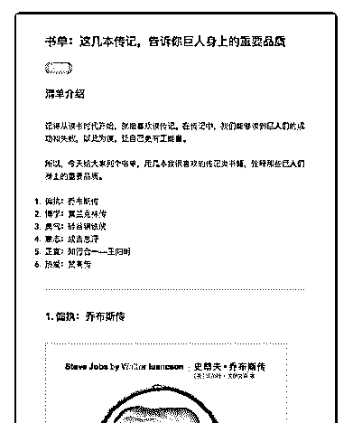
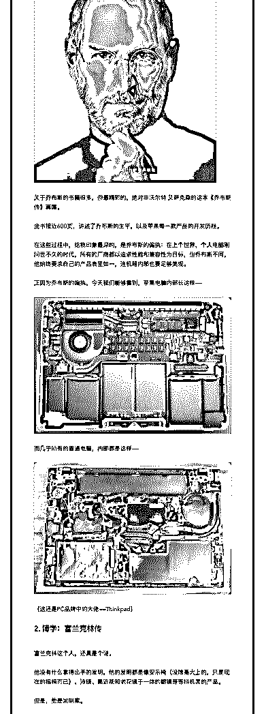
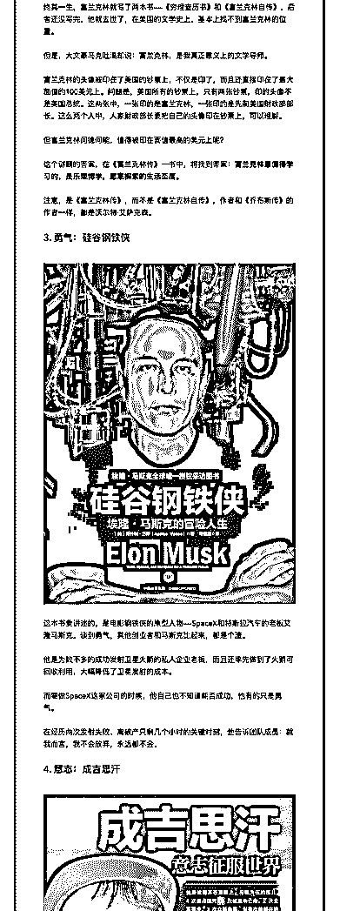
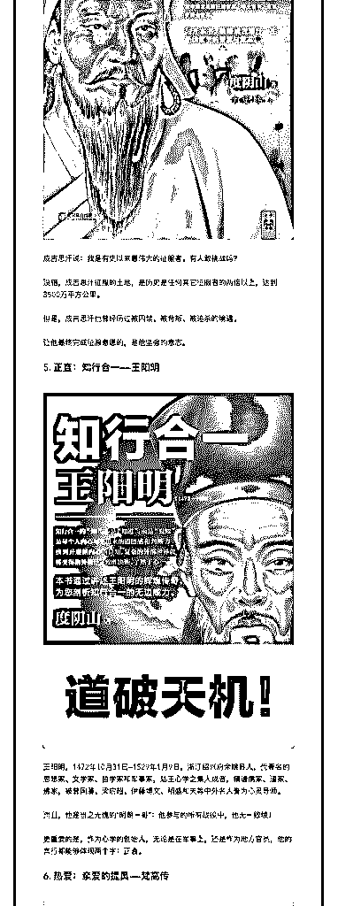
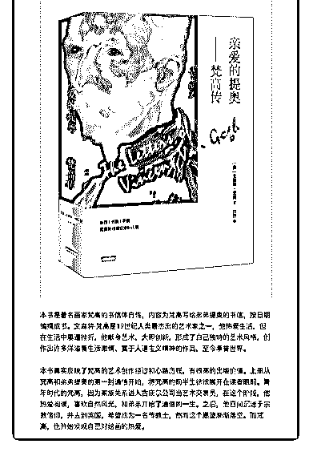

# 59.

《20181207 这几本传记，告诉你巨人身上的重要品质》

【清单介绍】

记得从读书时代开始，就挺喜欢读传记。在传记中，我们能够读到巨人们的成 功和失败，以此为镜，让自己更有正能量。

所以，今天给大家列个书单，用几本我很喜欢的传记类书籍，诠释那些巨人们 身上的重要品质。

1\. 偏执：乔布斯传

2\. 博学：富兰克林传

3\. 勇气：硅谷钢铁侠

4\. 意志：成吉思汗

5\. 正直：知行合一——王阳明

6\. 热爱：梵高传

---

【1\. 偏执：乔布斯传】 关于乔布斯的书籍很多，但最精彩的，绝对非沃尔特·艾萨克森的这本《乔布

斯传》莫属。

全书接近 600 页，讲述了乔布斯的生平，以及苹果每一款产品的开发历程。 在这些过程中，给我印象最深的，是乔布斯的偏执：在上个世界，个人电脑刚

问世不久的时代，所有的厂商都以追求性能和兼容性为目标，但乔布斯不同，

他始终要求自己的产品表里如一，连机箱内部也要足够美观。

正因为乔布斯的偏执，今天我们能够看到，苹果电脑内部长这样——

而几乎所有的普通电脑，内部都是这样——

（这还是 PC 品牌中的大佬——Thinkpad）

【2\. 博学：富兰克林传】 富兰克林这个人，还真是个谜。

他没有什么拿得出手的发明，他的发明都是像安乐椅（没啥高大上的，只是现 在的摇椅而已）、泳镜、集近视和老花镜于一体的眼镜等等抖机灵的产品。

但是，他是发明家。 终其一生，富兰克林就写了两本书——《穷理查历书》和《富兰克林自传》，

后者还没写完，他就去世了，在美国的文学史上，基本上找不到富兰克林的位

置。

但是，大文豪马克吐温却说：富兰克林，是我真正意义上的文学导师。 富兰克林的头像被印在了美国的钞票上，不仅是印了，而且还直接印在了最大

面值的 100 美元上。问题是，美国所有的钞票上，只有两张钞票，印的头像不 是美国总统。这两张中，一张印的是富兰克林，一张印的是先前美国财政部部

长。这么两个人中，人家财政部长要把自己的头像印在钞票上，可以理解。

但富兰克林何德何能，值得被印在面值最高的美元上呢？ 这个谜题的答案，在《富兰克林传》一书中，将找到答案：**富兰克林最值得

学习的，是乐观博学，愿意探索的生活态度。**

注意，是《富兰克林传》，而不是《富兰克林自传》，作者和《乔布斯传》的 作者一样，都是沃尔特·艾萨克森。

【3\. 勇气：硅谷钢铁侠】 这本书要讲述的，是电影钢铁侠的原型人物——SpaceX 和特斯拉汽车的老板

艾隆马斯克。谈到勇气，其他创业者和马斯克比起来，都是个渣。

他是为数不多的成功发射卫星火箭的私人企业老板，而且还率先做到了火箭可 回收利用，大幅降低了卫星发射的成本。

而要做 SpaceX 这家公司的时候，他自己也不知道能否成功，他有的只是勇 气。

在经历两次发射失败、离破产只剩几个小时的关键时刻，他告诉团队成员：就 我而言，我不会放弃，永远都不会。

【4\. 意志：成吉思汗】 成吉思汗说：我是有史以来最伟大的征服者。有人敢挑战吗？

没错，成吉思汗征服的土地，是历史是任何其它征服者的两倍以上，达到 3500 万平方公里。

但是，成吉思汗也曾经历过被囚禁、被背叛、被追杀的境遇。

让他最终完成征服意愿的，是他坚强的意志。

【5\. 正直：知行合一——王阳明】 王阳明，1472 年 10 月 31 日—1529 年 1 月 9 日，浙江绍兴府余姚县人，代著名的思

想家、文学家、哲学家和军事家，陆王心学之集大成者，精通儒家、道家、佛

家，被曾国藩、梁启超、伊藤博文、稻盛和夫等中外名人誉为心灵导师。

而且，他是当之无愧的“明朝一哥”：他参与的所有战役中，他无一败绩！ 更重要的是，作为心学的创始人，无论是在军事上，还是作为地方官员，他的

言行都能够体现两个字：正直。

【6\. 热爱：亲爱的提奥——梵高传】 本书是著名画家梵高的书信体自传，内容为梵高写给弟弟提奥的书信，按日期

编撰成书。文森特·梵高是 19 世纪人类最杰出的艺术家之一，他热爱生活，但 在生活中屡遭挫折，他献身艺术，大胆创新，形成了自己独特的艺术风格，创

作出许多洋溢着生活激情、富于人道主义精神的作品，至今享誉世界。

本书真实反映了梵高的艺术创作经过和心路历程，有很高的出版价值。上册从 梵高和弟弟提奥的第一封通信开始，将梵高的前半生徐徐展开在读者眼前。青 年时代的梵高，因为家族关系进入古庇尔公司当艺术交易员，在这个阶段，他 热爱阅读，喜欢自然风光，和弟弟开始了通信的一生。之后，他日间沉迷于宗 教信仰，并去到英国，希望成为一名传教士，然而这个愿望渐渐落空。而梵 高，也开始发现自己对绘画的热爱。

评论：

