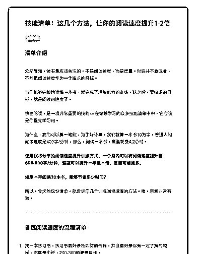
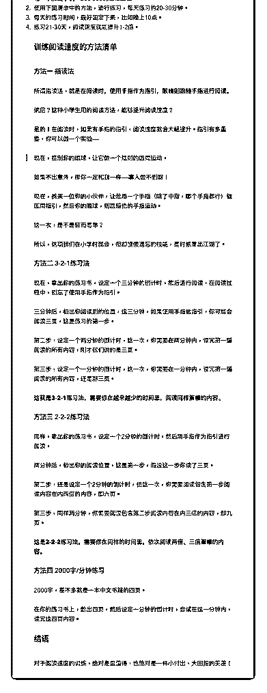

# 60.

《20181205 这几个方法，让你的阅读速度提升 1-2 倍》

【清单介绍】

众所周知，读书最应该关注的，不是阅读速度，而是质量。但这并不意味着， 不能把阅读速度作为一个追求的目标。

当你能够完整地读懂一本书，就完成了理解能力的训练，这之后，要追求的目 标，就是阅读的速度了。

快速阅读，是一项非常重要的技能——在你想学习的众多技能清单中中，它应 该是你最先学习的。

为什么，我们可以算一笔账，为了好计算，我们就算一本书 10 万字，普通人的 阅读速度是 400 字/分钟，那么，阅读一本书，需要耗费 4.2 小时。

**使用我将分享的阅读速度提升训练方式，一个月内可以将阅读速度提升到 600-800 字/分钟，速度可以提升一半至一倍，甚至可能更多。**

**如果一年阅读 30 本书，能够节省多少时间？**

所以，今天的这份清单，就告诉你几个训练阅读速度的方法。嗯，亲测非常有 效。

---

【训练阅读速度的流程清单】

1\. 找一本练习书，练习书最好是技能类的书籍，并且最好是你有一定了解的领 域，不能是小说，200-300 的篇幅最佳。

2\. 使用下面清单中的方法，进行练习，每天练习约 20-30 分钟。

3\. 每天的练习时间，最好固定下来，比如晚上 10 点。

4\. 练习 21-30 天，阅读速度就能提升 1-2 倍。

【训练阅读速度的方法清单】

〖方法一 指读法〗 所谓指读法，就是**在阅读时，使用手指作为指引，眼睛则跟随手指进行阅

读。**

纳尼？这种小学生用的阅读方法，能够提升阅读速度？

是的！在阅读时，如果有手指的指引，阅读速度就会大幅提升。指引有多重 要，你可以做一个实验——

> 现在，控制你的眼球，让它做一个规则的圆周运动。 如果不出意外，那你一定和我一样——寡人做不到呀！ 现在，找来一位你的小伙伴，让他用一个手指（除了中指，哪个手指都行）做

圆周指引，然后你的眼球，则跟随他的手指运动。

这一次，是不是轻而易举？ 所以，这项我们在小学时就会，但却慢慢遗忘的技能，是时候重出江湖了。

〖方法二 3-2-1 练习法〗

现在，拿出你的练习书，设定一个三分钟的倒计时，然后进行阅读，在阅读过 程中，别忘了使用手指作为指引。

三分钟后，标出你阅读到的位置，这三分钟，如果使用手指做指引，你可能会 阅读三页，这是练习的第一步。

第二步，设定一个两分钟的倒计时，这一次，你需要在两分钟内，读完第一遍 阅读的所有内容，刚才我们说的是三页。

第三步，设定一个一分钟的倒计时，这一次，你需要在一分钟内，读完第一遍 阅读的所有内容，还是那三页。

**这就是 3-2-1 练习法，需要你在越来越少的时间里，阅读同样篇幅的内容。**

〖方法三 2-2-2 练习法〗

同样，拿出你的练习书，设定一个 2 分钟的倒计时，然后用手指作为指引进行 阅读。

两分钟后，标出你的阅读位置，这是第一步，假设这一步你读了三页。 第二步，还是设定一个 2 分钟的倒计时，但这一次，你需要阅读包含第一步阅

读内容在内两倍的内容，即六页。

第三步，同样两分钟，你需要阅读包含第二步阅读内容在内三倍的内容，即九 页。

**这是 2-2-2 练习法，需要你在同样的时间里，依次阅读两倍、三倍篇幅的内 容。**

〖方法四 2000 字/分钟练习〗 2000 字，差不多就是一本中文书籍的四页。

在你的练习书上，数出四页，然后设定一分钟的倒计时，尝试在这一分钟内， 读完这四页内容。

【结语】 对于阅读速度的训练，绝对是最值得，也绝对是一件小付出、大回报的美差！

评论：

