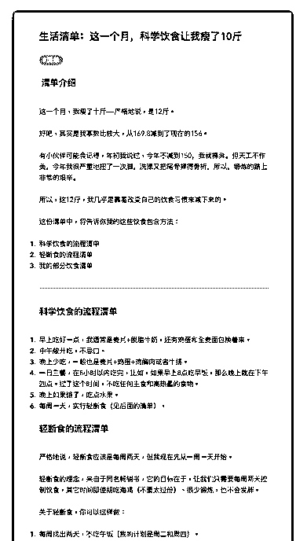
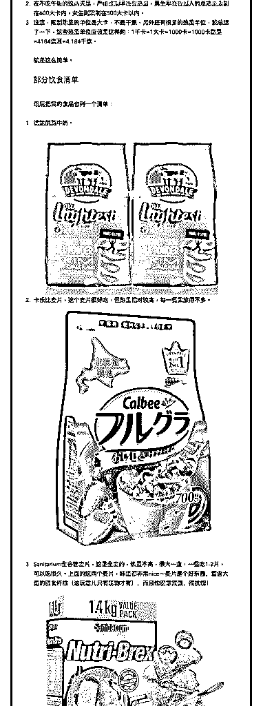
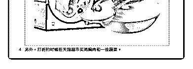

# 61.

《

《20181204 这一个月，科学饮食让我瘦了 10 斤》

【清单介绍】 这一个月，我瘦了十斤——严格地说，是 12 斤。 好吧，其实是我基数比较大，从 169.8 减到了现在的 156。

有小伙伴可能会记得，年初我说过，今年不减到 150，我就裸奔。但天工不作 美，今年我很严重地扭了一次脚，洗澡又把尾骨摔得骨折，所以，锻炼的路上 非常的艰辛。

所以，这 12 斤，我几乎是靠着改变自己的饮食习惯来减下来的。 这份清单中，将告诉你我的这些饮食包含方法：

1\. 科学饮食的流程清单

2\. 轻断食的流程清单

3\. 我的部分饮食清单

---

【科学饮食的流程清单】

1\. 早上吃好一点，我通常是麦片+脱脂牛奶，还有鸡蛋和全麦面包换着来。

2\. 中午敞开吃，不忌口。

3\. 晚上少吃，一般也是麦片+鸡蛋+鸡胸肉或者牛排。

4\. 一日三餐，在 8 小时以内吃完，比如，如果早上 8 点吃早饭，那么晚上就在下

午四点。过了这个时间，不吃任何主食和高热量的食物。

5\. 晚上如果饿了，吃点水果。

6\. 每周一天，实行轻断食（见后面的清单）。

【轻断食的流程清单】 严格地说，轻断食应该是每周两天，但我现在先从一周一天开始。

轻断食的理念，来自于同名畅销书，它的目标在于，让我们只需要每周两天控 制饮食，其它时间即使胡吃海喝（不要太过份）、很少锻炼，也不会发胖。

关于轻断食，你可以这样做：

1\. 每周找出两天，不吃午饭（我的计划是周二和周四）。

2\. 在不吃午饭的这两天里，严格控制早晚餐热量，男生早晚餐摄入的总热量限 制在 600 大卡内，女生则限制在 500 大卡以内。

3\. 注意，限制热量的单位是大卡，不是千焦，另外还有很多的热量单位，我总 结了一下，这些热量单位应该是这样的：1 千卡=1 大卡=1000 卡=1000 卡路里

=4184 焦耳=4.184 千焦。

就是这么简单。

【部分饮食清单】 最后把我的食品也列一个清单： 1\. 德运脱脂牛奶。

2\. 卡乐比麦片，这个麦片很好吃，但热量相对较高，每一餐我放得不多。

3\. Sanitarium 全谷物麦片，这是全麦的，热量不高，很大一盒，一餐吃 1-2 片， 可以吃很久。上面的这两个麦片，味道都非常 nice～麦片是个好东西，富含大 量的膳食纤维（这玩意儿只有植物才有），而且饱腹感很强，很抗饿！

4\. 另外，打折的时候在天猫超市买鸡胸肉和一些蔬菜。 评论：

