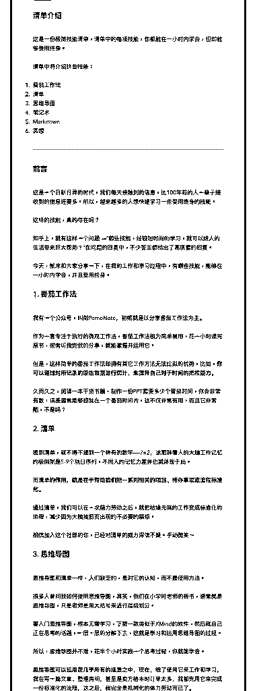
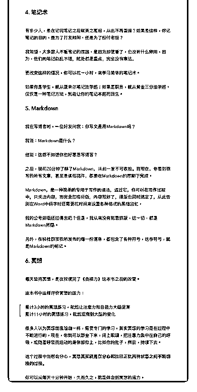

# 63.

《

《20181201 这些技能，每项学习时间不到一小时，却能受用终身！》

【清单介绍】

这是一份极简技能清单，清单中的每项技能，你都能在一小时内学会，但却能 够受用终身。

清单中将介绍这些技能：

1\. 番茄工作法

2\. 清单

3\. 思维导图

4\. 笔记术

1.  Markdown

2.  冥想

---

【前言】

这是一个日新月异的时代，我们每天接触到的信息，比 100 年前的人一辈子接 收到的信息还要多。所以，越来越多的人想快速学习一些受用终身的技能。

这样的技能，真的存在吗？ 知乎上，就有这样一个问题——“哪些技能，经较短时间的学习，就可以给人

的生活带来巨大帮助？”在问题的回复中，不少答主都给出了高质量的回复。

今天，就来和大家分享一下，在我的工作和学习过程中，有哪些技能，能够在 一小时内学会，并且受用终身。

【 1\. 番茄工作法】 我有一个公众号，叫做 PomoNote，初期就是以分享番茄工作法为主。 作为一套专注于执行的微观工作法，番茄工作法极为简单易用，花一小时读完

原书，或者听我完我的分享，就能掌握并运用它。

但是，这样简单的番茄工作法却拥有其它工作方法无法比拟的优势，比如，** 你可以通过对所记录的原始数据进行统计，来提升自己对于时间的把控能力。

**

久而久之，阅读一本干货书籍、制作一份 PPT 需要多少个番茄时间，你会非常 有数，误差通常能够控制在一个番茄时间内，这不仅非常有用，而且它非常 酷，不是吗？

【2\. 清单】 提到清单，就不得不提到一个神奇的数字——7±2，这意味着人的大脑工作记

忆的极限就是 5-9 个项目序列，不同人的记忆力差异也就体现于此。

而**清单的作用，就是在于帮助我们把一系列相关的项目、待办事项或流程标 准化。**

通过清单，我们可以在一次脑力劳动之后，就把枯燥无味的工作变成标准化的 流程，减少因为大脑抽筋而出现的不必要的麻烦。

相信加入这个社群的你，已经对清单的威力深信不疑。手动微笑～

【 3\. 思维导图】 思维导图和清单一样，人们缺乏的，是对它的认知，而不是使用方法。 很多人曾问我如何使用思维导图，其实，我们在小学时老师的板书，通常就是

思维导图，只是老师是用大括号来进行层级划分。

要入门思维导图，根本无需学习，下载一款类似于 XMind 的软件，然后就自己 正在思考的话题，一层一层的分解下去，这就是学习和运用思维导图的过程。

所以，思维导图并不难，花半个小时实践一个思考过程，你就能学会。

**思维导图可以运用在几乎所有的场景之中**，现在，除了使用它来工作和学 习，我在写一篇文章、整理房间，甚至是卖方格本时订单太多，我都先用它来 完成一份标准化的流程，这之后，就完全是机械化的体力劳动而已了。

【4\. 笔记术】 有多少人，是在记完笔记之后就束之高阁，从此不再查阅？如果是这样，你记

笔记的目的，是为了打发时间，还是为了应付老板？

我知道，大多数人不看笔记的原因，是因为即使看了，也没有什么卵用，因 为，他们的笔记杂乱不堪，随处都是重点，完全没有章法。

要改变这样的情况，你可以花一小时，来学习简单的笔记术。

如果你是学生，就从康奈尔笔记法学起；如果是职员，就从黄金三分法学起。 仅仅是一种笔记方法，就能让你的笔记本起死回生。

【5\. Markdown】 我在写博客时，一位好友问我：你写文是用 Markdown 吗？ 我说：Markdown 是什么？ 他说：这都不知道你也好意思写博客？

之后，我花 20 分钟了解了 Markdown，从此一发不可收拾。到现在，你看到我 写的所有文章，甚至是课程稿件，都是在 Markdown 的帮助下完成。

Markdown，是一种简单的专用于写作的语法，通过它，你可以在写作过程 中，只关注内容，而完全忽略排版，内容写好了，排版也同时搞定了，从此告 别在 Word 中码字时还需要花时间来设置各种格式的黑暗回忆。

我的公号排版还过得去吧？但是，我从来没有刻意排版，这一切，都是

Markdown 所赐。

另外，在轻社群里我所发布的每一份清单，都包含了各种符号，这些符号，就 是 Markdown 的标记。

【 6\. 冥想】 每天坚持冥想，是在我读完了《自控力》这本书之后的改变。 这本书中这样评价冥想的威力：

> 累计 3 小时的冥想练习，就能让注意力和自控力大幅提高

> 累计 11 小时的冥想练习，就能观察到大脑的变化

很多人认为冥想就像瑜珈一样，需要专门的学习，其实冥想的学习是在过程中 不断进行的，现在，你就可以静坐下来，闭上眼睛，把注意力集中在自己的呼 吸，或随着呼吸而运动的身体部位上，比如你的肚子，然后，持续下去。

这个过程中当然会分心，**冥想其实就是在分心和拉回正轨两种状态之间不断 切换的过程。**

你可以从每天十分钟开始，久而久之，就能体会到冥想的威力。

----

以上。 评论：

