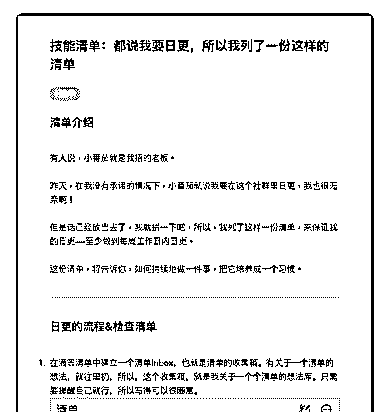
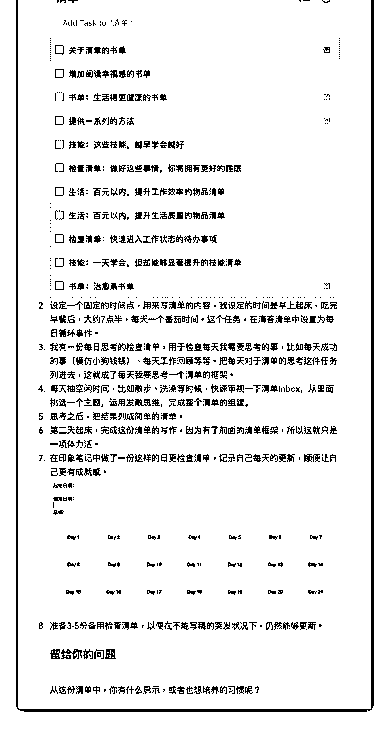

# 65.

《

《20181129 都说我要日更，所以我列了一份这样的清单》

【清单介绍】 有人说，小番茄就是我招的老板。

昨天，在我没有承诺的情况下，小番茄就说我要在这个社群里日更，我也很无 奈啊！

但是话已经放出去了，我就拼一下吧，所以，我列了这样一份清单，来保证我 的日更——至少做到每周工作日内日更。

这份清单，将告诉你，如何持续地做一件事，把它培养成一个习惯。

---

【日更的流程&检查清单】

1\. 在滴答清单中建立一个清单 Inbox，也就是清单的收集箱。有关于一个清单 的想法，就往里扔，所以，这个收集箱，就是我关于一个个清单的想法库。只 需要提醒自己就行，所以写得可以很随意。

2\. 设定一个固定的时间点，用来写清单的内容，我设定的时间是早上起床，吃 完早餐后，大约 7 点半，每天一个番茄时间。这个任务，在滴答清单中设置为 每日循环事件。

3\. 我有一份每日思考的检查清单，用于检查每天我需要思考的事，比如每天成 功的事（模仿小狗钱钱）、每天工作回顾等等。把每天对于清单的思考这件任 务列进去，这就成了每天我要思考一个清单的框架。

4\. 每天抽空闲时间，比如散步、洗澡等时候，快速审视一下清单 Inbox，从里 面挑选一个主题，运用发散思维，完成整个清单的组建。

5\. 思考之后，把结果列成简单的清单。

6\. 第二天起床，完成这份清单的写作，因为有了前面的清单框架，所以这就只 是一项体力活。

5\. 思考之后，把结果列成简单的清单。

6\. 第二天起床，完成这份清单的写作，因为有了前面的清单框架，所以这就只 是一项体力活。

【留给你的问题】 从这份清单中，你有什么启示，或者也想培养的习惯呢？

评论：

