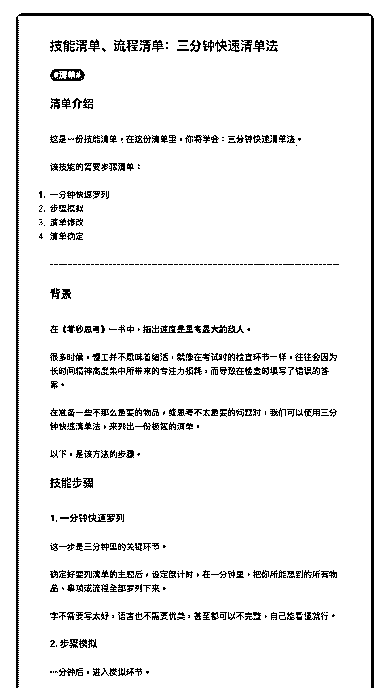
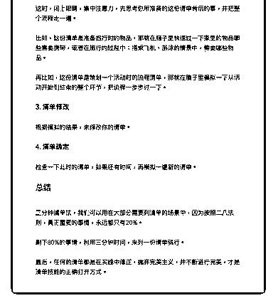

# 67.

《

《20181127 三分钟快速清单法》

【清单介绍】 这是一份技能清单，在这份清单里，你将学会：**三分钟快速清单法**。 该技能的简要步骤清单：

1\. 一分钟快速罗列

2\. 步骤模拟

3\. 清单修改

4\. 清单确定

---

【背景】 在《零秒思考》一书中，指出**速度是思考最大的敌人**。

很多时候，慢工并不意味着细活，就像在考试时的检查环节一样，往往会因为 长时间精神高度集中所带来的专注力损耗，而导致在检查时填写了错误的答 案。

在准备一些不那么重要的物品，或思考不太重要的问题时，我们可以使用三分 钟快速清单法，来列出一份极简的清单。

以下，是该方法的步骤。

【技能步骤】

〖1\. 一分钟快速罗列〗 这一步是三分钟里的关键环节。

确定好要列清单的主题后，设定倒计时，在一分钟里，把你所能想到的所有物 品、事项或流程全部罗列下来。

字不需要写太好，语言也不需要优美，甚至都可以不完整，自己能看懂就行。

〖2\. 步骤模拟〗 一分钟后，进入模拟环节。

这时，闭上眼睛，集中注意力，去思考你所准备的这份清单背后的事，并把整 个流程走一遍。

比如，这份清单是准备旅行时的物品，那就在脑子里快速过一下家里的物品哪 些需要携带，或者在旅行的过程中：搭乘飞机、游泳的情景中，需要哪些物 品。

再比如，这份清单是策划一个活动时的流程清单，那就在脑子里模拟一下从活 动开始到结束的整个环节，把流程一步步过一下。

〖 3\. 清单修改〗

根据模拟的结果，来修改你的清单。

〖4\. 清单确定〗 检查一下此时的清单，如果还有时间，再模拟一遍新的清单。

【总结】

三分钟清单法，我们可以用在大部分需要列清单的场景中，因为按照二八法 则，真正重要的事情，永远都只有 20%。

剩下 80%的事情，利用三分钟时间，来列一份清单就行。 最后，任何的清单都是在实践中修正，抛弃完美主义，并不断进行完美，才是

清单技能的正确打开方式。

评论：

