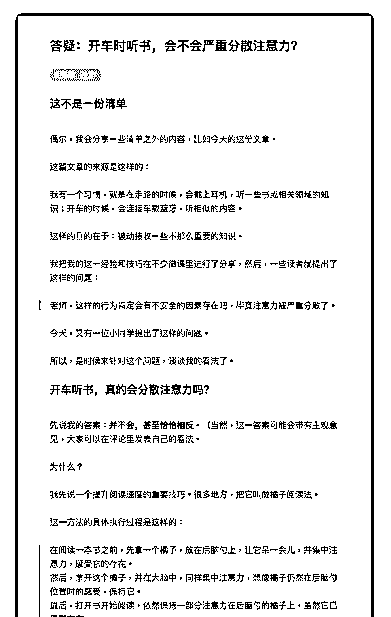
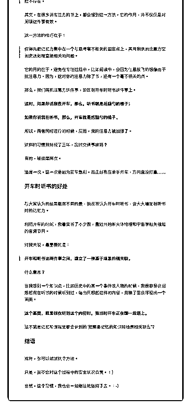

# 68.

《20190312 答疑：开车时听书，会不会严重分散注意力？》

【这不是一份清单】 偶尔，我会分享一些清单之外的内容，比如今天的这份文章。 这篇文章的来源是这样的：

我有一个习惯，就是在走路的时候，会戴上耳机，听一些书或相关领域的知 识；开车的时候，会连接车载蓝牙，听相似的内容。

这样的目的在于：被动接收一些不那么重要的知识。 我把我的这一经验和技巧在不少微课里进行了分享，然后，一些读者就提出了

这样的问题：

> 老师，这样的行为肯定会有不安全的因素存在吧，毕竟注意力被严重分散 了。

今天，又有一位小同学提出了这样的问题。 所以，是时候来针对这个问题，谈谈我的看法了。

【开车听书，真的会分散注意力吗？】

先说我的答案：**并不会，甚至恰恰相反**。（当然，这一答案可能会带有主 观意见，大家可以在评论里发表自己的看法。

为什么？

我先说一个提升阅读速度的重要技巧。很多地方，把它叫做橘子阅读法。 这一方法的具体执行过程是这样的：

> 在阅读一本书之前，先拿一个橘子，放在后脑勺上，让它呆一会儿，并集中 注意力，感受它的存在。

> 然后，拿开这个橘子，并在大脑中，同样集中注意力，想像橘子仍然在后脑 勺位置时的感受，保持它。

> 最后，打开书开始阅读，依然保持一部分注意力在后脑勺的橘子上，虽然它 已经不存在。

其实，在很多讲专注力的书上，都会提到这一方法，它的作用，并不仅仅是对 阅读这件事有效。

这一方法的技巧在于：

> 你得先把记忆力集中在一个与思考毫不相关的固定点上，再用剩余的注意力 空闲资源处理直接相关的问题。

它的目的在于，避免在专注过程中，比如阅读中，会因为任意放飞的想像而干 扰注意力。因为，这时你的注意力除了书，还有一个毫不相关的点。

那么，我们再把注意力这件事，说回到开车时听书这件事上。

**这时，如果你说我在开车，那么，听书就是后脑勺的橘子；**

**如果你说我在听书，那么，开车就是后脑勺的橘子。** 所以，两者同时进行的时候，反而，我的注意力被加强了。 这样的习惯我持续了三年，出过交通事故吗？

有的，被追尾两次。 追尾一次，这一次是因为前车急刹，而正好我在单手开车，方向盘没打赢……

【开车时听书的好处】

与大家认为的结果截然不同的是，我反而认为开车时听书，会大大增加我听书 时的记忆力。

利用开车的时间，我着实听了不少数，最近开始听天体物理和宇宙学相关领域 的音频节目。

对我来说，最重要的是：

> **开车和听书这两件事之间，建立了一种基于场景的强关联。**

什么意思？

当我想到一个知识点，比如历史中的某一个事件或人物的时候，我很容易会回 想起我在听书的时候听到过，每当回想起这样的内容，我脑子里会浮现出一个 画面。

**这个画面，就是我在听到这个内容时，我当时开车正在哪一段路上。**

这不就是记忆和课程里都会讲到的“把需要记忆的知识和场景相关联么”？

【结语】 或许，你可以试试这个方法。

只是，我不会对这个过程中的安全状况负责。：） 当然，这个习惯，我也会一如继往地坚持下去。：-）

评论：

清单控沙牛 : 本文讨论：你认为开车时听书会影响注意力吗？在这里说说你的 看法吧！

PS：如果你有关于清单、阅读或其它个人提升领域的问题，可以在星球里点 击提问（见图片），我会尽力解答你的问题。更重要的是：提问免费。：）

