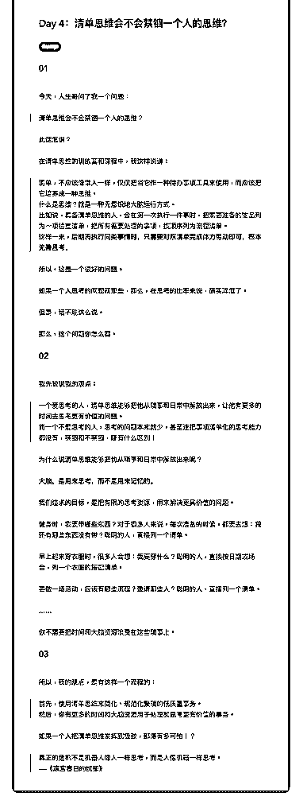

# 70.

《20190308 清单思维会不会禁锢一个人的思维？》

【01】 今天，人生哥问了我一个问题：

> 清单思维会不会禁锢一个人的思维？ 此话怎讲？ 在清单思维的训练营和课程中，我这样说道：

> 清单，不应该像常人一样，仅仅把当它作一种待办事项工具来使用，而应该 把它培养成一种思维。

> 什么是思维？就是一种无意识地大脑运行方式。

> 比如说，具备清单思维的人，会在第一次执行一件事时，把需要准备的物品

列为一项检查清单，把所有需要处理的事项，按顺序列为流程清单。

> 这样一来，**后期再执行同类事情时，只需要对照清单完成体力劳动即可， 根本无需思考。**

所以，这是一个很好的问题。 如果一个人思考的问题就那些，那么，在思考的比率来说，确实降低了。 但是，话不能这么说。

那么，这个问题你怎么看。

【02】 我先说说我的观点：

> 一个爱思考的人，清单思维能够把他从琐事和日常中解放出来，让他有更多 的时间去思考更有价值的问题。

> 而一个不爱思考的人，思考的问题本来就少，甚至连把事项清单化的思考能 力都没有，禁锢和不禁锢，哪有什么区别！

为什么说清单思维能够把他从琐事和日常中解放出来呢？

**大脑，是用来思考，而不是用来记忆的。** 我们追求的目标，是把有限的思考资源，用来解决更具价值的问题。 健身时，我要带哪些东西？对于很多人来说，每次准备的时候，都要去想：我

还有哪些东西没有带？聪明的人，直接列一个清单。

早上起来穿衣服时，很多人会想：我要穿什么？聪明的人，直接按日期或场 合，列一个衣服的搭配清单。

要做一场活动，应该有哪些流程？邀请哪些人？聪明的人，直接列一个清单。

……

你不需要把时间和大脑资源浪费在这些琐事上。

【03】 所以，我的观点，是有这样一个流程的：

> 首先，使用清单思维来简化、规范化繁琐的低质量事务。

> 然后，你有更多的时间和大脑资源用于处理和思考更有价值的事务。

如果一个人把清单思维发挥到极致，那得有多可怕！？

> 真正的危机不是机器人像人一样思考，而是人像机器一样思考。

> ——《凉宫春日的忧郁》

评论：

