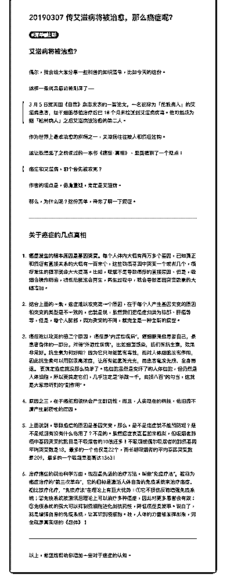

# 73.

《

《20190307 传艾滋病将被治愈，那么癌症呢？》

【艾滋病将被治愈？】 偶尔，我会给大家分享一些科普的知识清单，比如今天的这份。 这样一条消息最近被刷屏了——

> 3 月 5 日据英国《自然》杂志发表的一篇论文，一名被称为「伦敦病人」的

艾滋病患者，经干细胞移植治疗后已 18 个月未检测到艾滋病病毒。他可能成

为继「柏林病人」之后艾滋病被治愈的第二人。

作为世界上最难治愈的疾病之一，艾滋病往往被人和癌症挂钩。 这让我想起了之前读过的一本书《癌症‧真相》，里面提到了一个观点：

> 癌症和艾滋病，哪个会先被攻克？

作者的观点是，毋庸置疑，肯定是艾滋病。 那么，为什么呢？这份清单，带你了解一下癌症。

---

【关于癌症的几点真相】

1\. **癌症发生的根本原因是基因突变。**每个人体内大概有两万多个基因，已 知真正和癌症有直接关系的大概有一百来个，这些致癌基因中突变一个或者几 个，癌症发生的概率就会大大提高。比如，吸烟不是导致癌症的直接原因，但 是，吸烟会操作肺泡，损伤后肺泡会再生，再生过程中，就会导致基因突变数 量的大幅增加。

2\. 结合上面的一条，癌症难以攻克第一个原因，在于每个人产生基因突变的原 因和突变的类型是不一致的，也就是说，虽然我们把癌症归类为肺部、肝癌等 等，但是，每个人肺部，因为突变的不同，就完全是一种全新的癌症。

3\. 癌症难以攻克的第二个原因， 癌症是“内源性疾病”，癌细胞来自患者自 己，是患者身体的一部分。对待“外源性疾病”，比如细菌感染，我们有抗生 素，效果非常好。抗生素为何好用？因为它只对细菌有毒性，而对人体细胞没 有作用，因此抗生素可以用到很高浓度，让所有细菌死光光，而患者毫发无 损，全身而退。 要搞定癌症就没那么简单了。癌细胞虽然是变坏了的人体细 胞，但仍然是人体细胞，所以要搞定它们，几乎注定是“杀敌一千，自损八 百”的勾当，这就是大家常听到的“副作用”。

4\. 原因之三，在于癌细胞很快会产生耐药性，而且，人类现在的科技，依旧搞 不清产生耐药性的原因。

5\. 上面说到，导致癌症的原因是基因突变，那么，是不是癌症就不能预防呢？ 是不是戒烟有没有什么鸟用了？不是的。虽然癌症表面看起来相似，但吸烟者 肺癌中基因突变的数目是不吸烟者的 10 倍还多！不吸烟或偶尔吸烟者的肺癌基 因平均突变数是 18，最多的一个也仅是 22 个，而长期吸烟者的平均基因突变数 是 209，最多的一个吸烟患者高达 1363！

6\. 治疗癌症的前沿科学方面，现在最先进的治疗方法，叫做“免疫疗法”，被称 为癌症治疗的“第三次革命”，它的目标是激活人体自身的免疫系统来治疗癌 症。相比放疗化疗，“免疫疗法”在理论上有巨大优势：①它不损伤反而增强免 疫系统；②免疫系统被激活后理论上可以治疗多种癌症，因此对更多患者会有 效；③免疫系统的强大可以抑制癌细胞进化出抗药性，降低癌症复发率。说白 了，就是增强自身的免疫系统，让其识别癌细胞。哇，人体的力量被发挥出 来，完全就是真实版的《超体》！

---

以上，希望能帮助你增加一些对于癌症的认知。 评论：

