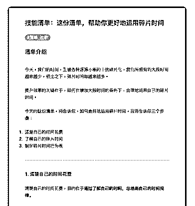
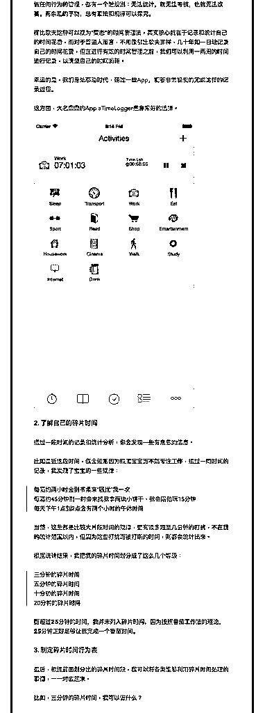
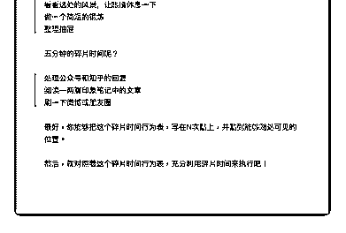

# 74.

《20181121 这份清单，帮助你更好地运用碎片时间》

【清单介绍】

今天，我们的时间，正被各种源源不断的干扰碎片化，我们所拥有的大段时间 越来越少，相比之下，碎片时间却越来越多。

提升效率的关键在于，如何在增加大段时间的条件下，合理地运用自己的碎片 时间。

今天的这份清单，将告诉你，如何更好地运用碎片时间，我将告诉你三个步 骤：

1\. 清楚自己的时间花费

2\. 了解自己的碎片时间

3\. 制定碎片时间行为表

---

【1\. 清楚自己的时间花费】 清楚自己的时间花费，目的在于**通过了解自己的时间，总结出自己的时间规

律。**

做任何行为的管理，都有一个潜规则：**无法统计，就无法考核，也就无法改 善。**再杂乱的事物，总有章法和规律可以探究。

柳比歇夫这种可以视为“变态”的时间管理法，其实核心就在于记录和统计自己 的时间花费，而对于普通人而言，不用像柳比歇夫那样，几十年如一日地记录 自己的时间花费，但在进行有效的时间管理之前，我们可以利用一两周的时间 进行记录，以清楚自己的时间消耗。

幸运的是，我们身处移动时代，通过一些 App，能够非常轻松的完成这样的记 录过程。

这方面，大名鼎鼎的 App aTimeLogger 是非常好的选择。

【2\. 了解自己的碎片时间】 通过一段时间的记录和统计分析，你会发现一些有意思的信息。

比如最近这段时间，我会经常因为照顾宝宝而不能专注工作，通过一周时间的 记录，我发现了宝宝的一些规律：

> 每隔约两小时会到书桌来“骚扰”我一次

> 每隔约 45 分钟到一时会来找我拿两块小饼干，我会陪他玩 15 分钟

> 每天下午 1 点到 2 点会有两个小时的午休时间

当然，这些都是比较大片段时间的规律，更有很多短至几分钟的打扰，不在我 的统计范围以内，但因为这些打扰而被打断的时间，则都会统计出来。

根据统计结果，我把我的碎片时间划分成了这么几个等级：

> 三分钟的碎片时间

> 五分钟的碎片时间

> 十分钟的碎片时间

> 20 分钟的碎片时间

**而超过 25 分钟的时间，我并未列入碎片时间，因为按照番茄工作法的理 论，25 分钟正好足够让我完成一个番茄时间。**

【3\. 制定碎片时间行为表】 最后，根据前面划分出的碎片时间段，我可以将各类能够利用碎片时间处理的

事情，一一对应起来。

比如，三分钟的碎片时间，我可以做什么？

> 看看远处的风景，让眼睛休息一下

> 做一个简短的锻炼

> 整理抽屉

五分钟的碎片时间呢？

> 处理公众号和知乎的回复

> 阅读一两篇印象笔记中的文章

> 刷一下微博或朋友圈

最好，你能够把这个碎片时间行为表，写在 N 次贴上，并贴到能够随处可见的 位置。

然后，就对照着这个碎片时间行为表，充分利用碎片时间来执行吧！ 评论：

