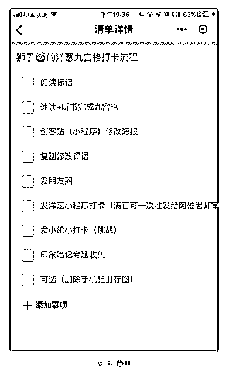

# 76\. 恭贺沙牛老师喜迁星

恭贺沙牛老师喜迁星球 ，奉上我的清单一份[耶] 2019 年参加了六哥的阅读挑战。据说国人一年平均读书不到十本。去年年底我

试验了一下速读速记法，并践行了手帐书籍主题阅读。一周两本的速度，是普

通人都可以达到的。

2019 年在洋葱海盗挑战里，我的目标是 100 天输出 30 本书的九宫格笔记。目前 时间尚有半个多月，只进行了 14 本……还差 16 本。

梳理了自己做打卡的流程清单，发在印象笔记微清单（小程序）里。嗯，分别 在三个地方打卡，是因为个人显摆、洋葱认证、小组活动的需要；存印象笔记 是作为收集汇总便于复盘。

不管怎么说，今年的阅读量已经超过去年的我，目前要来一个阶段性的冲 刺……毕竟，我的目标是 2019 年挑战 100 本。默默给自己喊个“加油”。

评论：

清单控沙牛 : 狮子小姐姐好棒～ 感谢分享

