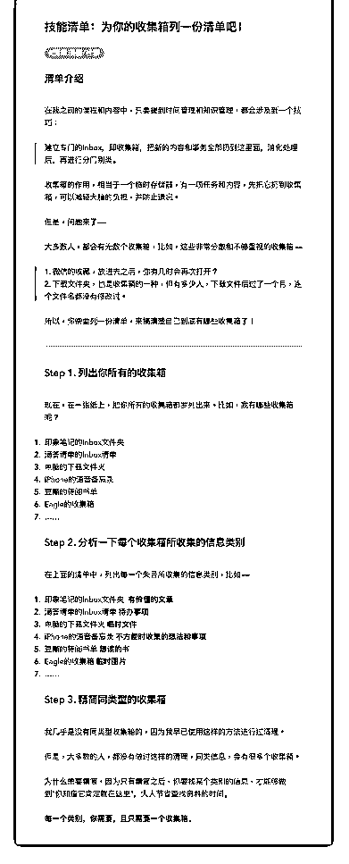

# 77.

《

《20190305 为你的收集箱列一份清单吧！》

【清单介绍】

在我之前的课程和内容中，只要提到时间管理和知识管理，都会涉及到一个技 巧：

> 建立专门的 Inbox，即收集箱，把新的内容和事务全部扔到这里面，消化处理 后，再进行分门别类。

收集箱的作用，相当于一个临时存储器，有一项任务和内容，先把它扔到收集 箱，可以减轻大脑的负担，并防止遗忘。

但是，问题来了—— 大多数人，都会有无数个收集箱，比如，这些非常分散和不够重视的收集箱

——

> 1\. 微信的收藏，放进去之后，你有几时会再次打开？

> 2\. 下载文件夹，也是收集箱的一种，但有多少人，下载文件后过了一个月，

连个文件名都没有修改过。

所以，你需要列一份清单，来搞清楚自己到底有哪些收集箱了！

---

【Step 1\. 列出你所有的收集箱】 现在，在一张纸上，把你所有的收集箱都罗列出来。比如，我有哪些收集箱

呢？

1\. 印象笔记的 Inbox 文件夹

2\. 滴答清单的 Inbox 清单

3\. 电脑的下载文件夹

4\. iPhone 的语音备忘录

5\. 豆瓣的待阅书单

1.  Eagle 的收集箱

2.  ……

【Step 2\. 分析一下每个收集箱所收集的信息类别】 在上面的清单中，列出每一个条目所收集的信息类别，比如—— 1\. 印象笔记的 Inbox 文件夹 **有价值的文章**

2\. 滴答清单的 Inbox 清单 **待办事项**

3\. 电脑的下载文件夹 **临时文件**

4\. iPhone 的语音备忘录 **不方便时收集的想法和事项**

5\. 豆瓣的待阅书单 **想读的书**

6\. Eagle 的收集箱 **临时图片**

7\. ……

【Step 3\. 精简同类型的收集箱】 我几乎是没有同类型收集箱的，因为我早已使用这样的方法进行过清理。 但是，大多数的人，都没有做过这样的清理，同类信息，会有很多个收集箱。

为什么需要精简，因为只有精简之后，你要找某个类别的信息，才能够做

到“你知道它肯定就在这里”，大大节省查找资料的时间。

**每一个类别，你需要，且只需要一个收集箱。**

评论：

