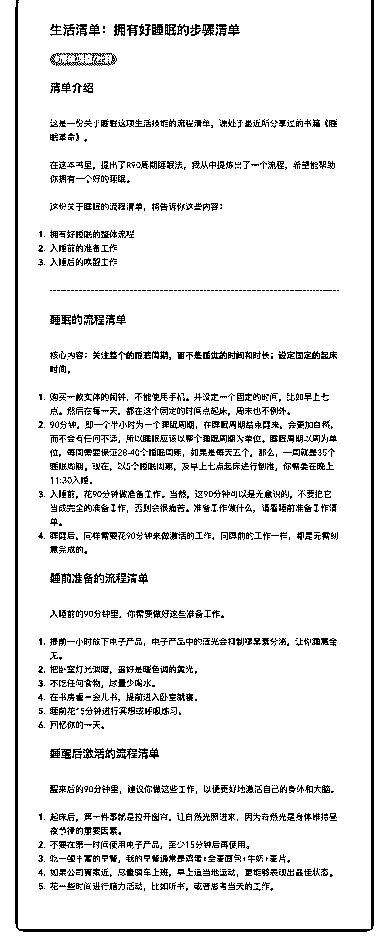

# 78.

《20181120 拥有好睡眠的步骤清单》

【清单介绍】

这是一份关于睡眠这项生活技能的流程清单，源处于最近所分享过的书籍《睡 眠革命》。

在这本书里，提出了 R90 周期睡眠法，我从中提炼出了一个流程，希望能帮助 你拥有一个好的睡眠。

这份关于睡眠的流程清单，将告诉你这些内容：

1\. 拥有好睡眠的整体流程

2\. 入睡前的准备工作

3\. 入睡后的唤醒工作

---

【睡眠的流程清单】

核心内容：**关注整个的睡眠周期，而不是睡觉的时间和时长；设定固定的起 床时间。**

1\. 购买一款实体的闹钟，不能使用手机。并设定一个固定的时间，比如早上七 点。然后在每一天，都在这个固定的时间点起床，周末也不例外。

2\. 90 分钟，即一个半小时为一个睡眠周期，在睡眠周期结束醒来，会更加自 然，而不会有任何不适，所以睡眠应该以整个睡眠周期为单位。睡眠周期以周 为单位，每周需要保证 28-40 个睡眠周期，如果是每天五个，那么，一周就是 35 个睡眠周期。现在，以 5 个睡眠周期，及早上七点起床进行倒推，你需要在 晚上 11:30 入睡。

3\. 入睡前，花 90 分钟做准备工作。当然，这 90 分钟可以是无意识的，不要把它

当成完全的准备工作，否则会很痛苦。准备工作做什么，请看睡前准备工作清

单。

4\. 睡醒后，同样需要花 90 分钟来做激活的工作，同睡前的工作一样，都是无需 刻意完成的。

【睡前准备的流程清单】 入睡前的 90 分钟里，你需要做好这些准备工作。

1\. 提前一小时放下电子产品，电子产品中的蓝光会抑制褪黑素分泌，让你睡意 全无。

2\. 把卧室灯光调暗，最好是暖色调的黄光。

3\. 不吃任何食物，尽量少喝水。

4\. 在书房看一会儿书，提前进入卧室就寝。

5\. 睡前花 15 分钟进行冥想或呼吸练习。

6\. 回忆你的一天。

【睡醒后激活的流程清单】 醒来后的 90 分钟里，建议你做这些工作，以便更好地激活自己的身体和大脑。

1\. 起床后，第一件事就是拉开窗帘，让自然光照进来，因为自然光是身体维持 昼夜节律的重要因素。

2\. 不要在第一时间使用电子产品，至少 15 分钟后再使用。

3\. 吃一顿丰富的早餐，我的早餐通常是鸡蛋+全麦面包+牛奶+麦片。

4\. 如果公司离家近，尽量骑车上班，早上适当地运动，更能够表现出最佳状

态。

5\. 花一些时间进行脑力活动，比如听书，或者思考当天的工作。

评论：

