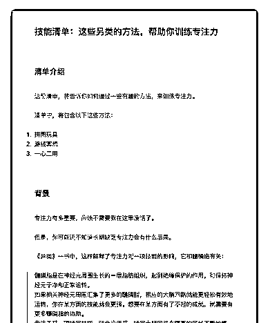
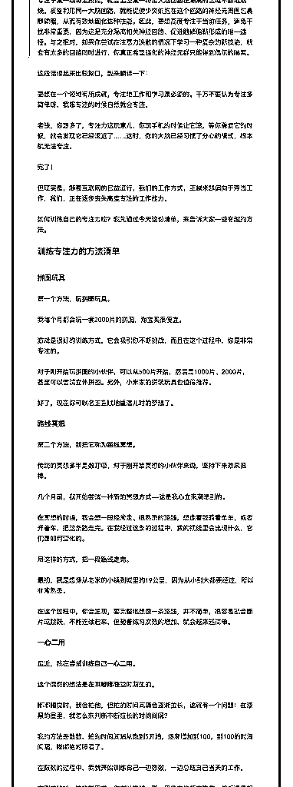
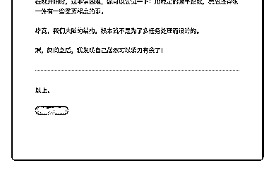

# 80.

《20181118 这些另类的方法，帮助你训练专注力》

【清单介绍】 这份清单，将告诉你如何通过一些有趣的方法，来训练专注力。 清单中，将包含以下这些方法：

1\. 拼图玩具

2\. 路线冥想

3\. 一心二用

---

【背景】 专注力有多重要，应该不需要我在这里废话了。 但是，你可能还不知道长期缺乏专注力会有什么后果。

《异类》一书中，这样解释了专注力对一项技能的影响，它和髓磷脂有关：

> 髓磷脂是在神经元周围生长的一层脂肪组织，起到绝缘保护的作用，可保持 神经元干净和正常运转。

> 如果相关神经元周围汇集了更多的髓磷脂，相应的大脑回路就能更轻松有效 地运转，你在某方面的技能就会更强。想要在某方面有了不起的成就，就需要 有更多髓磷脂的协助。

> 专注于某一项特定技能，就会迫使某一特定大脑回路在隔离的区域不断地燃 烧。反复利用同一大脑回路，就能促使少突细胞在这个回路的神经元周围包裹

髓磷脂，从而有效地固化这种技能。因此，要想高度专注于当前任务，避免干 扰非常重要，因为这是充分隔离相关神经回路、促进髓磷脂鞘形成的唯一途 径。与之相对，如果你尝试在注意力涣散的情况下学习一种复杂的新技能，就 会有太多的回路同时进行，你真正希望强化的神经元群只能得到偶尔的隔离。

这段话读起来比较拗口，我来翻译一下： 要想在一个领域有所成就，专注地工作和学习是必须的。千万不要认为专注多

简单呀，我想专注的时候自然就会专注。

老铁，你想多了，专注力这玩意儿，你玩手机的时候让它滚，等你需要它的时 候，就会发现它已经滚远了……这时，你的大脑已经习惯了分心的模式，根本 就无法专注。

完了！ 但现实是，随着互联网的日益流行，我们的工作方式，正越来越偏向于浮浅工

作，我们，正在逐步丧失高度专注的工作能力。

如何训练自己的专注力呢？我先通过今天这份清单，来告诉大家一些有趣的方 法。

【训练专注力的方法清单】

〖1\. 拼图玩具〗 第一个方法，**玩拼图玩具**。

我每个月都会玩一套 2000 片的拼图，淘宝买很便宜。

游戏是很好的训练方式，它会吸引你不断挑战，而且在这个过程中，你是非常 专注的。

对于刚开始玩拼图的小伙伴，可以从 500 片开始，然后是 1000 片、2000 片，甚 至可以尝试立体拼图。另外，小米家的拼装玩具也值得推荐。

好了，现在你可以名正言顺地重温儿时的梦想了。

〖2\. 路线冥想〗 第二个方法，我把它称为**路线冥想**。

传统的冥想多半是数呼吸，对于刚开始冥想的小伙伴来说，坚持下来效果很 棒。

几个月前，我开始尝试一种新的冥想方式——这是我心血来潮想到的。 在冥想的时候，我会想一段经常走、很熟悉的路线，想像着我骑着单车，或者

开着车，把这条路走完。在我经过这条的过程中，我的视线里会出现什么，它

们是如何变化的。

用这样的方式，把一段路线走完。 最初，我是想像从老家的小镇到城里的 19 公里，因为从小到大都要经过，所以

非常熟悉。

在这个过程中，你会发现，要完整地想像一条路线，并不简单，很容易就会断 片或跳跃，不能连续起来，但随着练习次数的增加，就会越来越简单。

〖3\. 一心二用〗 最近，我在**尝试训练自己一心二用。** 这个偶然的想法是在哄嘟嘟睡觉时萌生的。

嘟嘟睡觉时，我会拍他，但拍的时间间隔会逐渐拉长，这就有一个问题：在漆 黑的屋里，我怎么来判断不断拉长的时间间隔？

我的方法是数数，拍的时间间隔从数到 5 开始，逐渐增加到 100，到 100 的时间 间隔，嘟嘟绝对睡着了。

在数数的过程中，我就开始训练自己一边数数，一边总结自己当天的工作。 在刚开始时，这非常困难，你可以尝试一下：用稳定的频率数数，然后还得想

一件有一些重要程度的事。

毕竟，我们大脑的结构，根本就不是为了多任务处理而设计的。 嘿，两周之后，我发现自己居然可以游刃有余了！

---

以上。 评论：

