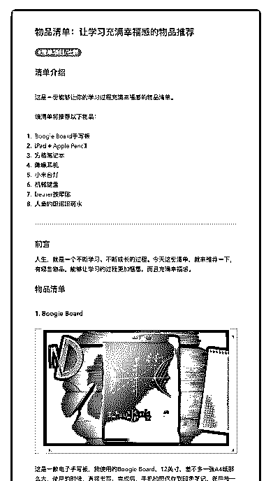
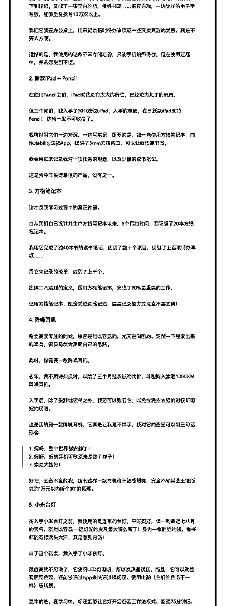
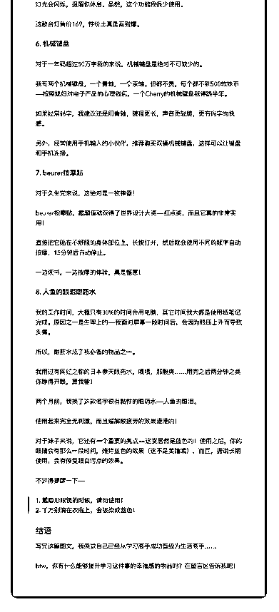

# 2

20181117 让学习充满幸福感的物品推荐

【清单介绍】 这是一份能够让你的学习过程充满幸福感的物品清单。 该清单将推荐以下物品：

1.  Boogie Board 手写板

2.  iPad + Apple Pencil 3\. 方格笔记本

4\. 降噪耳机

5\. 小米台灯

6\. 机械键盘

7\. beurer 按摩贴

8\. 人鱼的眼泪眼药水

---

【前言】 人生，就是一个不断学习、不断成长的过程。今天这份清单，就来推荐一下， 有哪些物品，能够让学习的过程更加惬意，而且充满幸福感。

【物品清单】

【1\. Boogie Board】

这是一款电子手写板，我使用的 Boogie Board，12 英寸，差不多一张 A4 纸那么 大，使用的时候，直接书写，完成后，手机拍照保存到印象笔记，然后按一下 删除键，又成了一张空白的纸，继续书写……据官方称，一块这样的电子手写 板，能够重复擦写 10 万次以上。

我把它放在办公桌上，用来记录临时待办事项或一些突发其想的灵感，真是不 要太方便。

遗憾的是，我使用的这款不带存储功能，只能手机拍照保存，但在使用过程 中，并未感受到不便。

【2\. 新款 iPad + Pencil】 在使用 Pencil 之前，iPad 对我没有太大的价值，已经沦为儿子的玩具。 但三个月前，我入手了 2018 新款 iPad，入手的原因，在于新款 iPad 支持

Pencil，这就一发不可收拾了。

我可以用它们一边听课，一边写笔记，重要的是，我一向使用方格笔记本，而

Notability 这款 App，提供了 5mm 方格内页，可以让我任意书写。

我会用它来记录我对一项任务的规划，以及少量的读书笔记。 这是我今年买得最值的产品，没有之一。

【3\. 方格笔记本】 这才是我学习过程中的真正神器。

自从我们自己设计并生产方格笔记本以来，8 个月的时间，我记满了 20 本方格 笔记本。

我用它完成了约 40 本书的读书笔记，规划了数十个项目，规划了上百项待办事 项……

用它来记录的清单，达到了上千个。 按照二八法则的定义，我用方格笔记本，完成了 80%最重要的工作。 使用方格笔记本，配合关键词笔记法，层层记录的方式简直不要太爽！

【4\. 降噪耳机】 需要高度专注的时候，噪音是难以容忍的，尤其是间断的、突然一下爆发出来

的噪音，很容易就会阻断自己的思路。

此时，你需要一款降噪耳机。 去年，我不顾媳妇反对，以跪了三个月挫衣板的代价，斗胆购入索尼 1000XM

降噪耳机。

入手后，除了安静地读书之外，我还可以戴着它，以免在跪挫衣板的时候听媳 妇的唠叨。

这是我的第一款降噪耳机，它真是让我爱不释手，我对它的感受可以用三句话 形容：

> 1\. 妈呀，整个世界都安静了！

> 2\. 妈呀，好的耳机听歌原来是这个样子！

> 3\. 索尼大法好！

好吧，五音不全的我，拥有这样一款耳机就幸福感爆棚，完全不顾某些土壕所 说的“万元以内听个响”的真理。

【5\. 小米台灯】

在入手小米台灯之前，我使用的是宜家的台灯，平时挺好，但一到最近七八月 的天气，就难以容忍——这灯光的发热量太特么高了！身为一枚胖纸的我，看 书都能看得满头大汗，真是憋到内伤！

出于这个初衷，我入手了小米台灯。 颜值高就不用说了，它使用 LED 灯照明，所以发热量很低。而且，它可以调整

亮度和色温，还能够通过 App 来快速选择阅读、使用电脑（它们的色温不一

样）等场景。

更牛的是，在学习中，你还能够让台灯开启番茄工作法模式，阅读 25 分钟后， 灯光会闪烁，提醒你休息。虽然，这个功能我很少使用。

这款台灯售价 169，性价比真是高到爆。

【6\. 机械键盘】 对于一年码超过 50 万字我的来说，机械键盘是绝对不可缺少的。 我有两个机械键盘，一个青轴，一个茶轴。但都不贵，每个都不到 500 软妹币

——按照媳妇对电子产品的心理钱包，一个 Cherry 的机械键盘我得跪半年。

如果经常码字，我建议还是用青轴，键程更长，声音更轻脆，更有码字的快 感。

另外，经常使用手机输入的小伙伴，推荐购买双模机械键盘，这样可以让键盘 和手机连接。

【 7\. beurer 按摩贴】 对于久坐党来说，这绝对是一枚神器！

beurer 按摩贴，靠颜值就获得了世界设计大奖——红点奖，而且它真的非常实 用！

直接把它贴在不舒服的身体部位上，长按打开，然后就会使用不同的频率自动 按摩，15 分钟后自动停止。

一边读书，一边按摩的体验，真是惬意！

【8\. 人鱼的眼泪眼药水】 我的工作时间，大概只有 30%的时间会用电脑，其它时间我大都是使用纸笔记

完成。原因之一是生理上的——我面对屏幕一段时间后，会因为眼压上升而导

致头痛。

所以，眼药水成了我必备的物品之一。 我用过有网红之称的日本参天眼药水，啧啧，那酸爽……用完之后两分钟之类

你睁得开眼，算我输！

两个月前，我换了这款名字很有黏性的眼药水——人鱼的眼泪。

使用起来完全无刺激，而且缓解眼疲劳的效果港港的！

对于妹子来说，它还有一个重要的亮点——这货居然是蓝色的！使用之后，你 的眼睛会有那么一段时间，维持蓝色的效果（这不是美瞳哦），而且，据说长 期使用，会有修复眼白污点的效果。

不过得提醒一下——

> 1\. 戴隐形眼镜的时候，请勿使用！

> 2\. 千万别滴在衣服上，会被染成蓝色！

【结语】 写完这篇图文，我感觉自己已经从学习高手成功晋级为生活高手……

btw，你有什么能够提升学习这件事的幸福感的物品吗？在留言区告诉我吧！ 评论：

