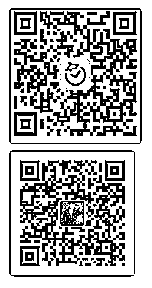

# 82.

通

通知：我为清单控们建了一个微信交流群～

Hi 亲爱的小伙伴们，众所周知，在这个知识星球里，我们将为大家分享大量 实用的清单，而且，这些清单会在工作日内日更。

为了更好的讨论学习，我们建了主题微信群，欢迎你的加入。 小番茄的微信（ID：pomo02，第 1 个二维码），拉你入群。

如果你已经有任何一个小番茄的微信，让 ta 拉你就行，不用专门加二号番茄

（pomo02）

在加入之前，我们希望你了解这份简单的介绍清单：

1\. 进群修改群名【城市-职业-昵称】。

2\. 拒绝任何形式的广告、二维码和小程序，违者都将收到马航飞机票。

3\. 群里可以讨论关于清单的技能，或者分享你认为很棒的清单。

4\. 我们会定期在群里发起活动（预计每周一次），每次活动都会送出暖心的小

礼物。

另外，还可以关注沙牛老师的公众号：清单控沙牛（ID：pomonote，第 2 个二 维码）

评论：

83\. “清单控沙牛”这个 “清单控沙牛”这个知识星球的终极使命 Hi，亲爱的你，恭喜你光荣晋级为一名清单控！

这是一个帮助你培养清单思维和习惯，并让你脑洞大开的社群。我们的目标 是，通过学习清单思维，让你实现：

1\. 不再因为忘掉重要的事情或纪念日，而丢人现眼或跪搓衣板。

2\. 将因为马虎而犯无能之错的概率，降低 90%。

3\. 为大脑减轻负担，并将效率提升 70%。

4\. 每天多出 2-3 小时来充分享受生活的乐趣。

为了实现这个目标，我们将在这里为你分享这些内容：

1\. 认知升级 帮你培养正确的清单理念，帮助你将清单培养成一种思维和习惯。

2\. 提供方法论 比如三分钟快速清单法、如何运用清单为大脑减轻负担，等等。

3\. 每 1-2 天提供现成的清单，包括但不限于： 技能类清单（如：克服拖延症的六个简单方法清单、拥有好睡眠的 6 个技巧清 单） 阅读类清单（如：有利于年轻人发展的 20 本书的清单、提升阅读速度的 6 个方 法清单） 物品类清单（如：100 元以内提高生活质量的 10 件好物推荐清单、帮助睡眠的 6 件好物推荐清单） 生活类清单（如：旅行前必需准备的 10 件事的清单、让房间不再零乱的 8 个整 理妙招清单）。

为了让你更快吸收内容，所有清单都采用统一的格式，如下： 标签：##

标题：《20190228 xxxxx》

一级标题 【】

二级标题 〖〗

有问题或投稿你的清单，都可以联系沙牛老师的私人微信：imsandox。你分享 的清单被发布到社群，就有小礼物赠送哦！

评论：

