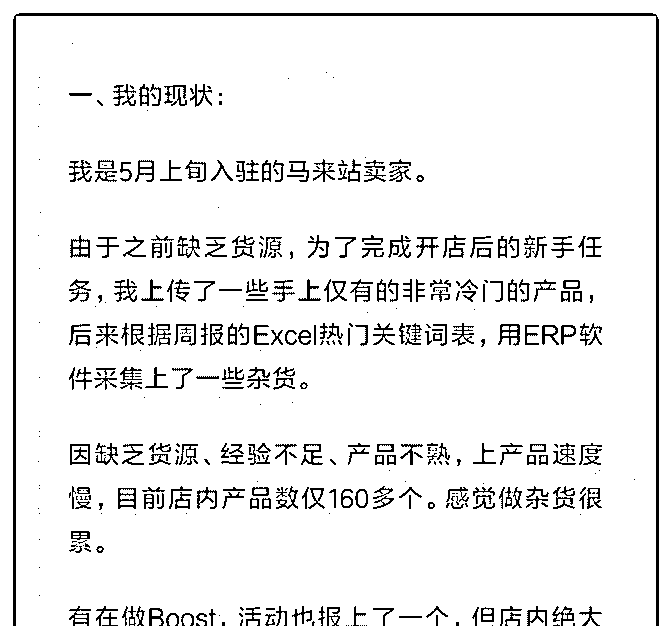
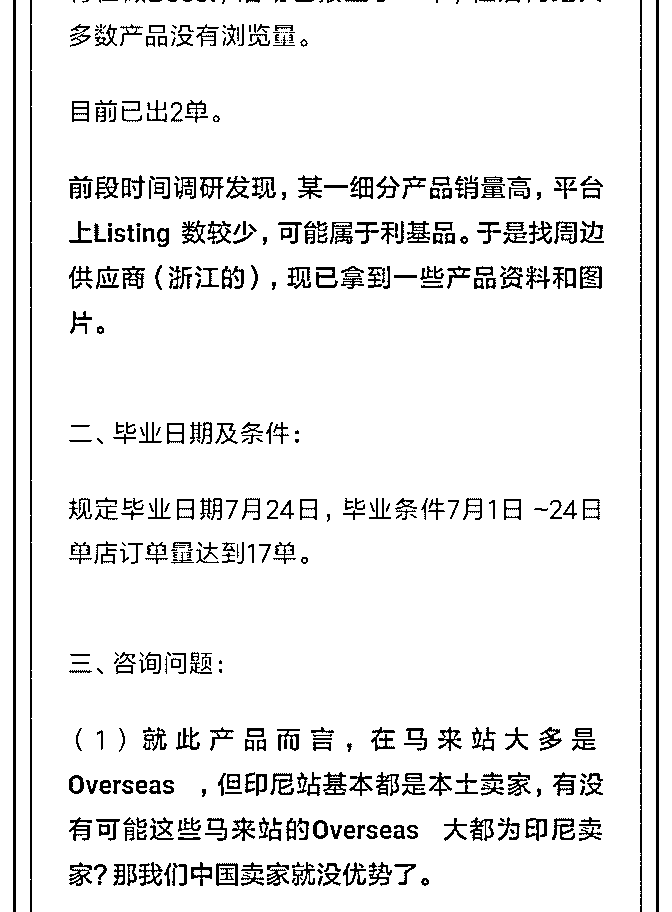
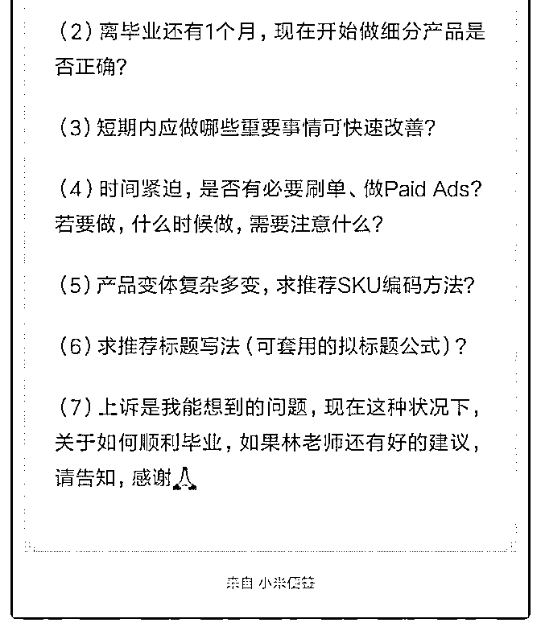

# 110.林老师你好，新店毕

用户 : 林老师你好，新店毕业救急... 因提问字数限制，问题 较长，详见图片：

2019-06-20

评论区：

3½ : 您好，请问你是怎么知道毕业时间跟毕业条件的？

林超 Mike : 问群里的工作人员。

林超 Mike : 时间是三个月，具体要求因不同经理而不同，最好你是问下你的群里的工作人员。

3½ : 问了，就是不肯说具体的，非常令人费解。

林超 Mike : 哈哈，因为官方也没个统一标准，一般是别计分超过 3，三个月成交有几十单，也就够了。

逍遥子 : 群主说的呗

回答：你好，说点题外话，排版很漂亮，真是有心，赞一个。

回答你的问题： 1.跨境卖家大多是中国卖家，这是资源和能力

决定的。 2.考核标准是单量和别被计分，先做多出单的，现在

谈过于细分只会导致出单难。 3.短期内最好出单方法，跟卖热

销品上，低价，开广告。亏一点钱也无所谓，先完成任务。 4\. 看第三点。 5.产品复杂多，没标准公式，你可以创造一个方 法。比如我们是按产品线，如 yifu001，kuzi001，qunzi001。 6\. 标题不用复杂或重复堆积关键词，也不讲究什么形容词修饰。 一般的产品词，品牌词，功能词组合即可。最简单的，参考下 热销同类型产品。 7.如上。 祝大卖～