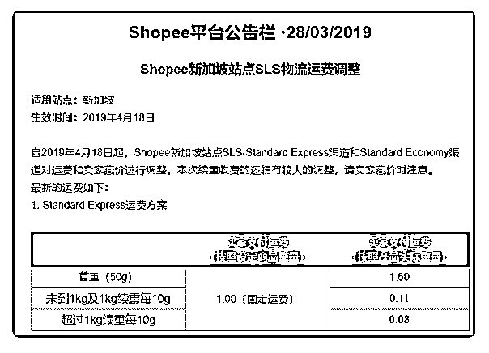

# 213.昨天虾皮的 SLS 物

车干木木 : 昨天虾皮的 SLS 物流把新加坡和马来站又双叒叕涨 运费了，尤其是 1kg 内的小东西。 我感觉再涨两次，就是完全包邮模式了。 这涨一次就要全改一次所有 sku 价格，请问有什么好方法批量 改价藏价啊？

2019-03-29

回答：你好，我的商品——右上角批量导出文件（建议谷歌邮 箱接收），下载表格后可以批量修改数据，然后再导进去即 可。