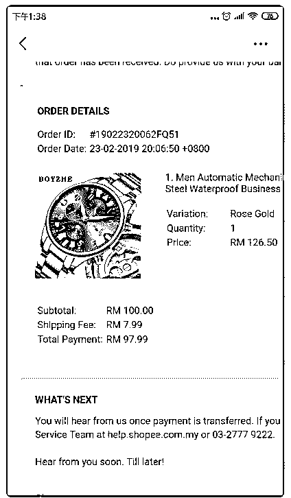

# 250.现在新店下来都是 1

Hunn : 现在新店下来都是 1000 了。后面会提高上产品数量 么。这个有什么标准

2019-03-09

评论区：

林超 Mike : 你好，具体规定要图片，平时什么最新消息也可以在这个链接上查看，shopee 官方公告。[Shopee](https://shimo.im/docs/GaspHRPksJ4oMOjq/read)[公告栏](https://shimo.im/docs/GaspHRPksJ4oMOjq/read)

Hunn : 好的。谢谢

关注公众号"懒人找资源"，星球资源一站式服务

251.林大，请问下关于价

外贸手表 : 林大，请问下关于价格计算方式，我看了那个价格计算器，但是还是想弄懂下是怎么计 算的，不知道计算逻辑，就不知道怎样上价格，例如图片，我就看不懂是什么意思。我暂时理解是 卖家只承担藏价运费和扣点，其他都不承担，不知道我的理解正确吗？或者举例子，现在成本 100 人 民币，利润 20%，打折 5 折，请问我上多少马币正确？帮忙解读下，谢谢您了！！！

2019-03-08

评论区：

外贸手表 : 我看了文章，我们卖家只关心藏价部分，其他就是扣点，那么图片中，我商品是 126.5 马币，那后面的数字都代表什么呢，最终我获得的是多少，莫非是最后的 97.99，如果是，那么是怎么计

算出来的，这个商品重量 300 克，麻烦您了！这个问题不解决，后期产品不敢上

林超 Mike : 微信上找我下

回答：你好，你没有说明重量，不清楚藏价费用。你先按后面这篇文章写的计算逻辑算下，如果还不 明白，可以微信找我聊聊。 <e type="web"

href="https%3A%2F%2Fmp.weixin.qq.com%2Fs%2FzEyTnE1a-7S_ygxdJye9Lg" title="%E8%99%BE%E7%9A%AEShopee%E8%BF%90%E8%B4%B9%E6%80%8E%E4%B9%88%E7%AE

cache="" />