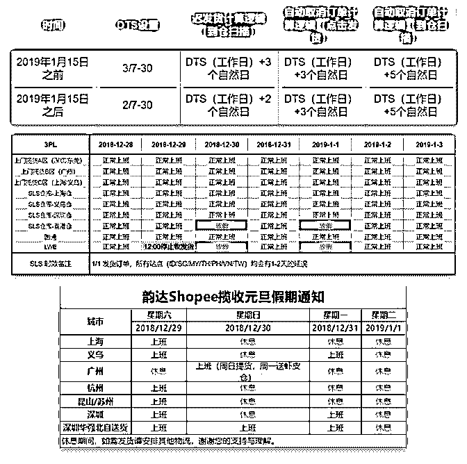

# 332.20181225<

1、【台湾站点物流咨询说明】

Shopee 台湾站点物流状态，卖家可事先通过 Shopee 卖家中心

或者圆通官网（）进行查询。

若超过 7 天物流状态仍未更新，再请联系 Shopee 客服协助查

询。

详情查询下面链接：

2、【各站点非预售商品备货天数（DTS）变更】 为进一步提升买家用户体验，Shopee 站点非预售商品的备货 天数(DTS)将从 2019 年 1 月 15 日起，从 3 天调整为 2 天。同时， 迟发货计算逻辑，也从 DTS+3 天，调整为 DTS+2 天。自动取 消计算逻辑不受影响。

3、【物流元旦放假安排】 元旦期间 3PL 会安排正常提货和收货，卖家发货和仓库收货基 本不受影响，但部分 3PL 因休假以及海关放假等原因不发货， 导致所有站点物流时效会有 1-2 天的延误，具体情况如下，请 悉知：

4、【韵达 Shopee 揽收元旦假期通知】 5、12 月第四周周报[`www.yto.net.cn/gw/index/index.ht`](http://www.yto.net.cn/gw/index/index.html)ml

[`yiqixie.com/d/home/fcACS7FJa-E8etsP9NPZ74CSt`](https://yiqixie.com/d/home/fcACS7FJa-E8etsP9NPZ74CSt)

2018-12-25

