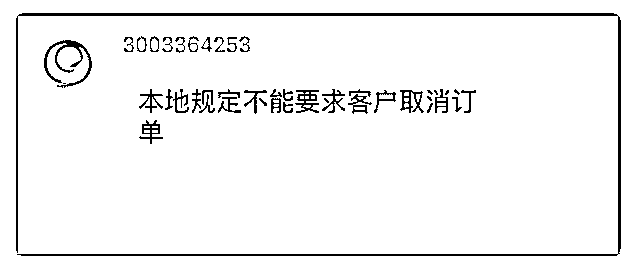

# 385.越南有订单没有货，

当小孩子长成大姑凉。 : 越南有订单没有货，想让客服联系客 人取消订单。客服做出如下回答。那意思是我们只能自己取 消订单？或者等过期系统自动取消。那这样岂不是影响店铺 的计分。现在店铺已经被记 4 分了，就是因为之前都是自己取 消订单。请问要解决比较好。

2018-11-15

评论区：

当小孩子长成大姑凉。 : 好的。明白了。谢谢。[玫瑰]

林超 Mike : 记错了，是 6 分才无补贴，所以还是可以搞。

当小孩子长成大姑凉。 : 好的，谢谢您。

回答：越南是这样，所以上新需要注意。被计 4 分的店铺可以 暂时关了，无补贴无法参加活动，同样精力不如投到其他的店 铺，等 1 月大赦计分清 0 再运营。