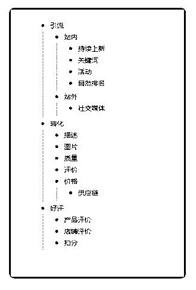

# 400.运营的三板斧

林超 Mike : 运营的三板斧

2018-11-05

#### 401.Hi, Mike

用户 : Hi, Mike 我有一个马来西亚的件经客户经理确认已经丢件，物流商已赔 偿，已收到虾皮拨款，订单显示已完成。但是客户那边表示没有收到商品，请问 客户那边要怎么赔偿货款？是让客户找虾皮客服申请赔偿吗？

2018-11-04

回答：是的，这种情况下就只能让客户联系当地的客服。联系方式：<e type="web" href="https%3A%2F%2Fyiqixie.com%2Fs%2Fhome%2FfcADihy5uKfsnG0fm3oUr9rEK" title="https%3A%2F%2Fyiqixie.com%2Fs%2Fhome%2FfcADihy5uKfsnG0fm3oUr9rEK"

/>