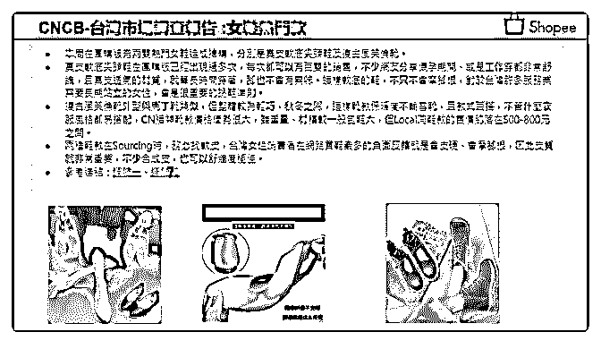

# 429.20181017<

1、【马来新政策：不要违规修改产品价格，不然产品会被删

除甚至扣分】

1) 执行时间：从 11.5 开始执行监管

2) 11.5-11.18, 升价 5%-10%会被平台记录，大于 10%会删除产

品

3) 11.19 之后，升价 5%- 10%会被平台记录，大于 10%会删除

产品，有五次删除情况会扣一分

4) 此政策对任何价格变动都适用

5) 平台会在活动前 10 天内监督价格变化

（重点：通过折扣调整不算，目前只针对原价的调整）

2、卖家自查产品被禁卖及下架原因方法

3、台湾热卖产品（参考下图）

2018-10-17

评论区：

炫^Li^青春 : 昨天刚改了价格今天就被禁卖，说不实的标价和无效的选项，大神从新上架审核时间大概需要多久

