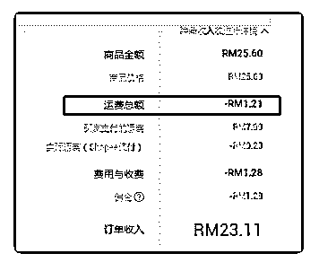

# 437.刚有个关于藏价运费

林超 Mike : 刚有个关于藏价运费的提问，不小按错给我删除 了。这里重新回复下，在后台我的进账中心中，可以在线查 看每个产品扣除多少藏价运费，导出来的表格没有这个维 度。

2018-10-09

评论区：

袁辉 : 后台的每一个订单收入是不是已经扣除过运费的？

林超 Mike : 如图中这张所示，是的。

袁辉 : 谢谢

Horizon : 马来站导出来的订单也没看到订单收入和实际运费这两个维度，计算运费的时候打开每个订单找吗？

林超 Mike : 在我的进账——已完成拨款中，可以导出表格，里面有「买家支付运费」和「shopee 为您代付运费」，后者减前

者可以得出你那批订单的藏价运费。

Horizon : 谢谢

林超 Mike : 20181008

十月 1-2 周市场周报

2018-10-08