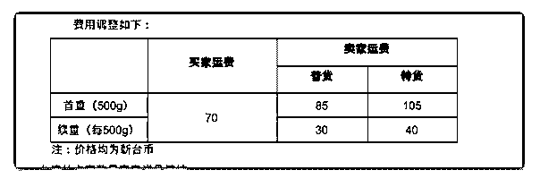

# 477.【关于台湾站点的运

林超 Mike : 【关于台湾站点的运费调整统一说明】@全体成员

（1）黑猫宅配，7-11 超取，全家 这三个物流方式，9/20 之后

，台湾买家支付固定运费 70 NTD

（目前是 55NTD）

（2）截图里面的卖家运费，指的是实际运费。

实际运费，是根据产品的重量来计算， 首重 500g, 超出首重部

分按规则增加运费

（3）需要藏价到商品价格的部分 = 实际运费 -70

举例 1：普货 -产品重量 490g 实际运费 85（没有超过首重）买 家付款 70 需藏价 15

举例 2：普货 -产品重量 1000g 实际运费 85+30=115（没有超过 首重）买家付款 70 需藏价 45

【重要】 具体不同重量产品的实际运费也可以查看群文件文

2018-09-06

评论区：

林超 Mike : 全家和 7-11 超取的运费不变 （买家端也不变是 55 台币） 只有黑猫宅配的运费有更新，9/20 生效

林超 Mike : 上图为黑猫宅配的

