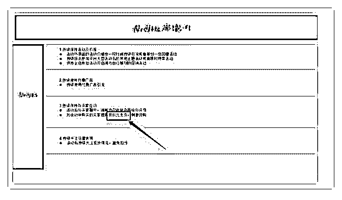
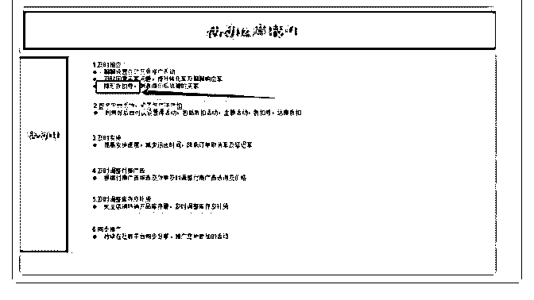

# 492.Dear Mike

Marqos : Dear Mike：请问在 Shopee 99 大促活动运营技巧 final 这个 PPT 中“隐形折扣券”，“复购优惠券”分别是什么意思，如 何设置？

2018-08-30

评论区：

林超 Mike : 就是普通的优惠券，设置方法一样的。在我的行销中心——设置折扣券里面设置，只是这里分为不同的作用。

第一，为客户咨询过程中告知有优惠券，很多客户即使你本身设置了全店，你不说他们也不留意的。这里为刺激客户购

买。 第二，复购优惠券，即向那些已经从你店里买过的客户提供，比如老客户二次购买“九折”。设置对应折扣的优惠券，

不公开，单为老客户所有。

